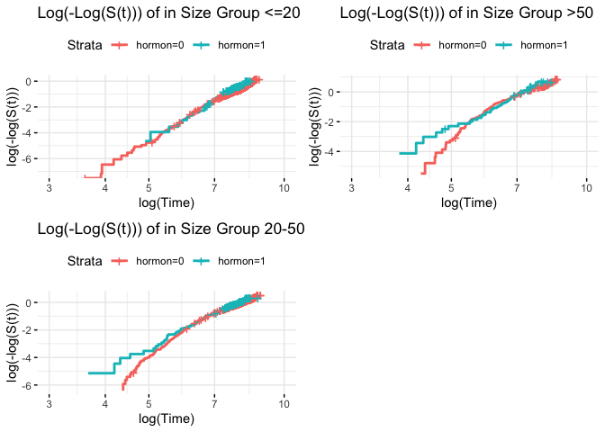

Cox Model
================
Youlan Shen

## Cox Model Assumption Checking

### checking if the proportional hazard assumption between two treatment groups

``` r
# data preprocessing
head(rotterdam)
```

    ##      pid year age meno  size grade nodes pgr  er hormon chemo rtime recur dtime
    ## 1393   1 1992  74    1  <=20     3     0  35 291      0     0  1799     0  1799
    ## 1416   2 1984  79    1 20-50     3     0  36 611      0     0  2828     0  2828
    ## 2962   3 1983  44    0  <=20     2     0 138   0      0     0  6012     0  6012
    ## 1455   4 1985  70    1 20-50     3     0   0  12      0     0  2624     0  2624
    ## 977    5 1983  75    1  <=20     3     0 260 409      0     0  4915     0  4915
    ## 617    6 1983  52    0  <=20     3     0 139 303      0     0  5888     0  5888
    ##      death
    ## 1393     0
    ## 1416     0
    ## 2962     0
    ## 1455     0
    ## 977      0
    ## 617      0

``` r
# liberal definition of rfs (count later deaths)
rotterdam <- rotterdam %>% 
  mutate(rfs = pmax(recur, death),
         rfstime = ifelse(recur == 1, rtime, dtime),
         grade = factor(grade)) 
```

``` r
colon_survfit_log = survfit(Surv(log(rfstime + 1), rfs) ~ hormon, data = rotterdam)
splots <- list()
splots[[2]] <- ggsurvplot(colon_survfit_log, data = rotterdam, fun = "cloglog",
                          risk.table = FALSE, xlab = "log(Time)", 
                          ggtheme = theme_minimal(), xlim = c(3,10))
splots[[2]]$plot + labs(title = "Log of Negative Log of Estimated Survival Function")
```

<!-- -->

From the log-log graph, the lines for two treatment groups are not
proportional to each other, therefore, the proportional hazard
assumption violates.

The line is close to a straight line with slope equal to 1, we could
consider using exponential distribution.

### trying stratified groups on size groups/age groups

``` r
size <- rotterdam %>% dplyr::select(size) %>% unique() %>% pull()
plot <- list()
for (i in 1:length(size)) {
  data <- rotterdam[rotterdam$size == size[i], ]
  colon_survfit_log = survfit(Surv(log(rfstime + 1), rfs) ~ hormon, data = data)
  splots <- ggsurvplot(colon_survfit_log, data = data, fun = "cloglog",
                          risk.table = FALSE, xlab = "log(Time)", 
                          ggtheme = theme_minimal(), xlim = c(3,10)) + labs(title = paste("Log(-Log(S(t))) of in Size Group", size[i]))
  plot[[i]] <- splots
}
arrange_ggsurvplots(plot, print = TRUE,
  ncol = 2, nrow = 2, risk.table.height = 0.4)
```

<!-- -->

### check continuous variables interaction with time (not included since assumption is not violated)

``` r
# fit a entire cox model, find significant variables
# er and meno, seems less significant
fit1 <- coxph(Surv(rfstime, rfs) ~ age + meno + size + grade + nodes + pgr + er +
                hormon + chemo, data = rotterdam)

# change the data to variables with interaction with time
# nodes become no significant, pgr and er more significant
# except nodes, all other continuous variables have significant interaction with time
rotterdam <- rotterdam %>% 
  mutate(
    aget = age * log(rfstime),
    nodest = nodes * log(rfstime),
    pgrt = pgr * log(rfstime), 
    ert = er * log(rfstime)
)
fit2 <- coxph(Surv(rfstime, rfs) ~ age + meno + size + grade + nodes + pgr + er +
                hormon + chemo + aget + nodest + pgrt + ert, data = rotterdam)
```

### model fitting and plots

``` r
# stepwise model
model3 <- stepwiseCox(Surv(rfstime, rfs) ~ age + meno + size + grade + nodes + pgr + er +
                hormon + chemo + aget + nodest + pgrt + ert, data = rotterdam, 
            selection = "bidirection", select = "SL", method = "breslow", 
            sle = 0.25, sls = 0.15)
model3$`Selected Varaibles`
```

    ##        variables1 variables2 variables3 variables4 variables5 variables6
    ## xModel      nodes     nodest       aget        age       meno        ert
    ##        variables7 variables8 variables9 variables10
    ## xModel         er     hormon      grade        size

``` r
fit3 <- coxph(Surv(rfstime, rfs) ~ nodes + nodest + age + aget + meno + er + 
                ert + hormon + grade + size, data = rotterdam)
```

``` r
fit4 <- coxph(Surv(rfstime, rfs) ~ age + meno + size + grade + nodes + pgr + er +
                hormon + chemo, data = rotterdam)
stepwise_model <- stepAIC(fit4, direction = "both", trace = FALSE)
```

### observed and fitted plot/ fitted survival plot?

### model fit results

``` r
summary(fit1)
```

    ## Call:
    ## coxph(formula = Surv(rfstime, rfs) ~ age + meno + size + grade + 
    ##     nodes + pgr + er + hormon + chemo, data = rotterdam)
    ## 
    ##   n= 2982, number of events= 1713 
    ## 
    ##                 coef  exp(coef)   se(coef)      z Pr(>|z|)    
    ## age        3.209e-03  1.003e+00  3.283e-03  0.978   0.3283    
    ## meno       4.724e-02  1.048e+00  8.534e-02  0.554   0.5799    
    ## size20-50  3.582e-01  1.431e+00  5.469e-02  6.550 5.75e-11 ***
    ## size>50    6.483e-01  1.912e+00  8.229e-02  7.878 3.33e-15 ***
    ## grade3     3.236e-01  1.382e+00  6.030e-02  5.366 8.05e-08 ***
    ## nodes      7.416e-02  1.077e+00  4.428e-03 16.748  < 2e-16 ***
    ## pgr       -1.044e-04  9.999e-01  9.695e-05 -1.076   0.2817    
    ## er        -1.611e-05  1.000e+00  9.300e-05 -0.173   0.8625    
    ## hormon    -1.319e-01  8.765e-01  7.763e-02 -1.699   0.0894 .  
    ## chemo     -8.705e-02  9.166e-01  6.971e-02 -1.249   0.2117    
    ## ---
    ## Signif. codes:  0 '***' 0.001 '**' 0.01 '*' 0.05 '.' 0.1 ' ' 1
    ## 
    ##           exp(coef) exp(-coef) lower .95 upper .95
    ## age          1.0032     0.9968    0.9968     1.010
    ## meno         1.0484     0.9539    0.8869     1.239
    ## size20-50    1.4308     0.6989    1.2854     1.593
    ## size>50      1.9123     0.5229    1.6275     2.247
    ## grade3       1.3821     0.7235    1.2280     1.555
    ## nodes        1.0770     0.9285    1.0677     1.086
    ## pgr          0.9999     1.0001    0.9997     1.000
    ## er           1.0000     1.0000    0.9998     1.000
    ## hormon       0.8765     1.1410    0.7527     1.020
    ## chemo        0.9166     1.0910    0.7996     1.051
    ## 
    ## Concordance= 0.668  (se = 0.007 )
    ## Likelihood ratio test= 490.5  on 10 df,   p=<2e-16
    ## Wald test            = 614.4  on 10 df,   p=<2e-16
    ## Score (logrank) test = 678.3  on 10 df,   p=<2e-16

``` r
summary(fit2)
```

    ## Call:
    ## coxph(formula = Surv(rfstime, rfs) ~ age + meno + size + grade + 
    ##     nodes + pgr + er + hormon + chemo + aget + nodest + pgrt + 
    ##     ert, data = rotterdam)
    ## 
    ##   n= 2982, number of events= 1713 
    ## 
    ##                 coef  exp(coef)   se(coef)       z Pr(>|z|)    
    ## age        0.6973126  2.0083483  0.0134961  51.668  < 2e-16 ***
    ## meno       0.6829647  1.9797384  0.0938317   7.279 3.37e-13 ***
    ## size20-50  0.1478461  1.1593344  0.0552818   2.674 0.007486 ** 
    ## size>50   -0.0093088  0.9907344  0.0856653  -0.109 0.913468    
    ## grade3     0.1708631  1.1863283  0.0608491   2.808 0.004985 ** 
    ## nodes      0.1490212  1.1606976  0.0424914   3.507 0.000453 ***
    ## pgr        0.0031558  1.0031608  0.0007718   4.089 4.34e-05 ***
    ## er        -0.0047939  0.9952176  0.0007977  -6.010 1.86e-09 ***
    ## hormon    -0.2369153  0.7890581  0.0813774  -2.911 0.003599 ** 
    ## chemo      0.0855757  1.0893440  0.0716156   1.195 0.232114    
    ## aget      -0.1015336  0.9034508  0.0019522 -52.009  < 2e-16 ***
    ## nodest    -0.0187512  0.9814235  0.0064599  -2.903 0.003699 ** 
    ## pgrt      -0.0004561  0.9995440  0.0001127  -4.046 5.21e-05 ***
    ## ert        0.0007138  1.0007141  0.0001077   6.626 3.45e-11 ***
    ## ---
    ## Signif. codes:  0 '***' 0.001 '**' 0.01 '*' 0.05 '.' 0.1 ' ' 1
    ## 
    ##           exp(coef) exp(-coef) lower .95 upper .95
    ## age          2.0083     0.4979    1.9559    2.0622
    ## meno         1.9797     0.5051    1.6472    2.3795
    ## size20-50    1.1593     0.8626    1.0403    1.2920
    ## size>50      0.9907     1.0094    0.8376    1.1719
    ## grade3       1.1863     0.8429    1.0530    1.3366
    ## nodes        1.1607     0.8616    1.0679    1.2615
    ## pgr          1.0032     0.9968    1.0016    1.0047
    ## er           0.9952     1.0048    0.9937    0.9968
    ## hormon       0.7891     1.2673    0.6727    0.9255
    ## chemo        1.0893     0.9180    0.9467    1.2535
    ## aget         0.9035     1.1069    0.9000    0.9069
    ## nodest       0.9814     1.0189    0.9691    0.9939
    ## pgrt         0.9995     1.0005    0.9993    0.9998
    ## ert          1.0007     0.9993    1.0005    1.0009
    ## 
    ## Concordance= 0.958  (se = 0.001 )
    ## Likelihood ratio test= 6771  on 14 df,   p=<2e-16
    ## Wald test            = 2991  on 14 df,   p=<2e-16
    ## Score (logrank) test = 7134  on 14 df,   p=<2e-16

``` r
summary(fit3)
```

    ## Call:
    ## coxph(formula = Surv(rfstime, rfs) ~ nodes + nodest + age + aget + 
    ##     meno + er + ert + hormon + grade + size, data = rotterdam)
    ## 
    ##   n= 2982, number of events= 1713 
    ## 
    ##                 coef  exp(coef)   se(coef)       z Pr(>|z|)    
    ## nodes      0.1277911  1.1363155  0.0416811   3.066  0.00217 ** 
    ## nodest    -0.0153706  0.9847469  0.0062877  -2.445  0.01450 *  
    ## age        0.6996185  2.0129846  0.0134862  51.877  < 2e-16 ***
    ## aget      -0.1020754  0.9029615  0.0019487 -52.382  < 2e-16 ***
    ## meno       0.7011031  2.0159753  0.0917710   7.640 2.18e-14 ***
    ## er        -0.0036996  0.9963073  0.0007549  -4.901 9.56e-07 ***
    ## ert        0.0005620  1.0005621  0.0001021   5.502 3.76e-08 ***
    ## hormon    -0.2539732  0.7757126  0.0811638  -3.129  0.00175 ** 
    ## grade3     0.1803728  1.1976637  0.0603837   2.987  0.00282 ** 
    ## size20-50  0.1569283  1.1699117  0.0553120   2.837  0.00455 ** 
    ## size>50    0.0016241  1.0016254  0.0856660   0.019  0.98487    
    ## ---
    ## Signif. codes:  0 '***' 0.001 '**' 0.01 '*' 0.05 '.' 0.1 ' ' 1
    ## 
    ##           exp(coef) exp(-coef) lower .95 upper .95
    ## nodes        1.1363     0.8800    1.0472    1.2330
    ## nodest       0.9847     1.0155    0.9727    0.9970
    ## age          2.0130     0.4968    1.9605    2.0669
    ## aget         0.9030     1.1075    0.8995    0.9064
    ## meno         2.0160     0.4960    1.6841    2.4132
    ## er           0.9963     1.0037    0.9948    0.9978
    ## ert          1.0006     0.9994    1.0004    1.0008
    ## hormon       0.7757     1.2891    0.6616    0.9095
    ## grade3       1.1977     0.8350    1.0640    1.3481
    ## size20-50    1.1699     0.8548    1.0497    1.3039
    ## size>50      1.0016     0.9984    0.8468    1.1847
    ## 
    ## Concordance= 0.958  (se = 0.001 )
    ## Likelihood ratio test= 6754  on 11 df,   p=<2e-16
    ## Wald test            = 2988  on 11 df,   p=<2e-16
    ## Score (logrank) test = 7129  on 11 df,   p=<2e-16

``` r
summary(fit4)
```

    ## Call:
    ## coxph(formula = Surv(rfstime, rfs) ~ age + meno + size + grade + 
    ##     nodes + pgr + er + hormon + chemo, data = rotterdam)
    ## 
    ##   n= 2982, number of events= 1713 
    ## 
    ##                 coef  exp(coef)   se(coef)      z Pr(>|z|)    
    ## age        3.209e-03  1.003e+00  3.283e-03  0.978   0.3283    
    ## meno       4.724e-02  1.048e+00  8.534e-02  0.554   0.5799    
    ## size20-50  3.582e-01  1.431e+00  5.469e-02  6.550 5.75e-11 ***
    ## size>50    6.483e-01  1.912e+00  8.229e-02  7.878 3.33e-15 ***
    ## grade3     3.236e-01  1.382e+00  6.030e-02  5.366 8.05e-08 ***
    ## nodes      7.416e-02  1.077e+00  4.428e-03 16.748  < 2e-16 ***
    ## pgr       -1.044e-04  9.999e-01  9.695e-05 -1.076   0.2817    
    ## er        -1.611e-05  1.000e+00  9.300e-05 -0.173   0.8625    
    ## hormon    -1.319e-01  8.765e-01  7.763e-02 -1.699   0.0894 .  
    ## chemo     -8.705e-02  9.166e-01  6.971e-02 -1.249   0.2117    
    ## ---
    ## Signif. codes:  0 '***' 0.001 '**' 0.01 '*' 0.05 '.' 0.1 ' ' 1
    ## 
    ##           exp(coef) exp(-coef) lower .95 upper .95
    ## age          1.0032     0.9968    0.9968     1.010
    ## meno         1.0484     0.9539    0.8869     1.239
    ## size20-50    1.4308     0.6989    1.2854     1.593
    ## size>50      1.9123     0.5229    1.6275     2.247
    ## grade3       1.3821     0.7235    1.2280     1.555
    ## nodes        1.0770     0.9285    1.0677     1.086
    ## pgr          0.9999     1.0001    0.9997     1.000
    ## er           1.0000     1.0000    0.9998     1.000
    ## hormon       0.8765     1.1410    0.7527     1.020
    ## chemo        0.9166     1.0910    0.7996     1.051
    ## 
    ## Concordance= 0.668  (se = 0.007 )
    ## Likelihood ratio test= 490.5  on 10 df,   p=<2e-16
    ## Wald test            = 614.4  on 10 df,   p=<2e-16
    ## Score (logrank) test = 678.3  on 10 df,   p=<2e-16

``` r
summary(stepwise_model)
```

    ## Call:
    ## coxph(formula = Surv(rfstime, rfs) ~ age + size + grade + nodes + 
    ##     hormon + chemo, data = rotterdam)
    ## 
    ##   n= 2982, number of events= 1713 
    ## 
    ##                coef exp(coef)  se(coef)      z Pr(>|z|)    
    ## age        0.004264  1.004273  0.002169  1.966   0.0493 *  
    ## size20-50  0.360120  1.433502  0.054553  6.601 4.08e-11 ***
    ## size>50    0.646274  1.908416  0.081949  7.886 3.11e-15 ***
    ## grade3     0.335949  1.399267  0.059633  5.634 1.77e-08 ***
    ## nodes      0.074610  1.077464  0.004396 16.974  < 2e-16 ***
    ## hormon    -0.123227  0.884063  0.077213 -1.596   0.1105    
    ## chemo     -0.098512  0.906185  0.068519 -1.438   0.1505    
    ## ---
    ## Signif. codes:  0 '***' 0.001 '**' 0.01 '*' 0.05 '.' 0.1 ' ' 1
    ## 
    ##           exp(coef) exp(-coef) lower .95 upper .95
    ## age          1.0043     0.9957    1.0000     1.009
    ## size20-50    1.4335     0.6976    1.2881     1.595
    ## size>50      1.9084     0.5240    1.6252     2.241
    ## grade3       1.3993     0.7147    1.2449     1.573
    ## nodes        1.0775     0.9281    1.0682     1.087
    ## hormon       0.8841     1.1311    0.7599     1.029
    ## chemo        0.9062     1.1035    0.7923     1.036
    ## 
    ## Concordance= 0.667  (se = 0.007 )
    ## Likelihood ratio test= 488.6  on 7 df,   p=<2e-16
    ## Wald test            = 614.2  on 7 df,   p=<2e-16
    ## Score (logrank) test = 677.5  on 7 df,   p=<2e-16
