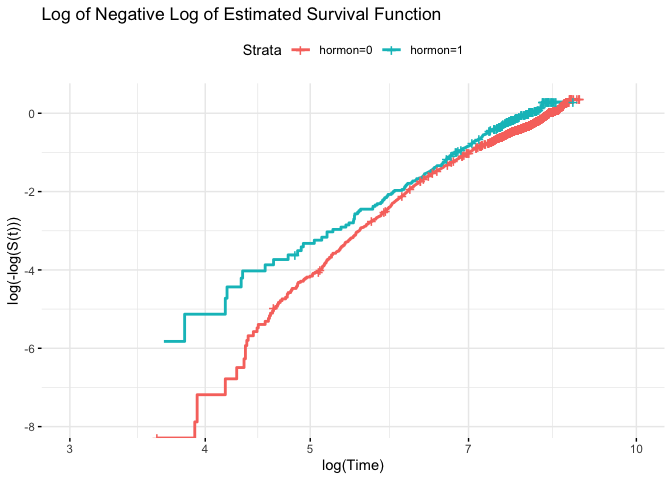

Cox Model
================
Youlan Shen

## Cox Model Assumption Checking

### checking if the proportional hazard assumption between two treatment groups

``` r
# data preprocessing
head(rotterdam)
```

    ##      pid year age meno  size grade nodes pgr  er hormon chemo rtime recur dtime
    ## 1393   1 1992  74    1  <=20     3     0  35 291      0     0  1799     0  1799
    ## 1416   2 1984  79    1 20-50     3     0  36 611      0     0  2828     0  2828
    ## 2962   3 1983  44    0  <=20     2     0 138   0      0     0  6012     0  6012
    ## 1455   4 1985  70    1 20-50     3     0   0  12      0     0  2624     0  2624
    ## 977    5 1983  75    1  <=20     3     0 260 409      0     0  4915     0  4915
    ## 617    6 1983  52    0  <=20     3     0 139 303      0     0  5888     0  5888
    ##      death
    ## 1393     0
    ## 1416     0
    ## 2962     0
    ## 1455     0
    ## 977      0
    ## 617      0

``` r
# liberal definition of rfs (count later deaths)
rotterdam <- rotterdam %>% 
  mutate(rfs = pmax(recur, death),
         rfstime = ifelse(recur == 1, rtime, dtime))
```

``` r
colon_survfit_log = survfit(Surv(log(rfstime + 1), rfs) ~ hormon, data = rotterdam)
splots <- list()
splots[[2]] <- ggsurvplot(colon_survfit_log, data = rotterdam, fun = "cloglog",
                          risk.table = FALSE, xlab = "log(Time)", 
                          ggtheme = theme_minimal(), xlim = c(3,10))
splots[[2]]$plot + labs(title = "Log of Negative Log of Estimated Survival Function")
```

<!-- -->

From the log-log graph, the lines for two treatment groups are not
proportional to each other, therefore, the proportional hazard
assumption violates.

The line is close to a straight line with slope equal to 1, we could
consider using exponential distribution.

### trying stratified groups on size groups/age groups

### check continuous variables interaction with time

``` r
# fit a entire cox model, find significant variables
# er and meno, seems less significant
fit1 <- coxph(Surv(rfstime, rfs) ~ age + meno + size + grade + nodes + pgr + er +
                hormon + chemo, data = rotterdam)

# change the data to variables with interaction with time
# nodes become no significant, pgr and er more significant
# except nodes, all other continuous variables have significant interaction with time
rotterdam <- rotterdam %>% 
  mutate(
    aget = age * log(rfstime),
    gradet = grade * log(rfstime),
    nodest = nodes * log(rfstime),
    pgrt = pgr * log(rfstime), 
    ert = er * log(rfstime)
)
fit2 <- coxph(Surv(rfstime, rfs) ~ age + meno + size + grade + nodes + pgr + er +
                hormon + chemo + aget + gradet + nodest + pgrt + ert, data = rotterdam)
```

### model fitting and plots

``` r
# stepwise model
model3 <- stepwiseCox(Surv(rfstime, rfs) ~ age + meno + size + grade + nodes + pgr + er +
                hormon + chemo + aget + gradet + nodest + pgrt + ert, data = rotterdam, 
            selection = "bidirection", select = "SL", method = "breslow", 
            sle = 0.25, sls = 0.15)
model3$`Selected Varaibles`
```

    ##        variables1 variables2 variables3 variables4 variables5 variables6
    ## xModel     gradet      grade     nodest     hormon        age       aget
    ##        variables7 variables8 variables9 variables10 variables11 variables12
    ## xModel       size       meno        ert        pgrt         pgr          er

``` r
fit3 <- coxph(Surv(rfstime, rfs) ~ gradet + grade   + nodest + hormon + age + aget + size +
                meno + ert + pgrt + pgr + er, data = rotterdam)
```

### observed and fitted plot/ fitted survival plot?

### model fit results

``` r
summary(fit1)
```

    ## Call:
    ## coxph(formula = Surv(rfstime, rfs) ~ age + meno + size + grade + 
    ##     nodes + pgr + er + hormon + chemo, data = rotterdam)
    ## 
    ##   n= 2982, number of events= 1713 
    ## 
    ##                 coef  exp(coef)   se(coef)      z Pr(>|z|)    
    ## age        3.209e-03  1.003e+00  3.283e-03  0.978   0.3283    
    ## meno       4.724e-02  1.048e+00  8.534e-02  0.554   0.5799    
    ## size20-50  3.582e-01  1.431e+00  5.469e-02  6.550 5.75e-11 ***
    ## size>50    6.483e-01  1.912e+00  8.229e-02  7.878 3.33e-15 ***
    ## grade      3.236e-01  1.382e+00  6.030e-02  5.366 8.05e-08 ***
    ## nodes      7.416e-02  1.077e+00  4.428e-03 16.748  < 2e-16 ***
    ## pgr       -1.044e-04  9.999e-01  9.695e-05 -1.076   0.2817    
    ## er        -1.611e-05  1.000e+00  9.300e-05 -0.173   0.8625    
    ## hormon    -1.319e-01  8.765e-01  7.763e-02 -1.699   0.0894 .  
    ## chemo     -8.705e-02  9.166e-01  6.971e-02 -1.249   0.2117    
    ## ---
    ## Signif. codes:  0 '***' 0.001 '**' 0.01 '*' 0.05 '.' 0.1 ' ' 1
    ## 
    ##           exp(coef) exp(-coef) lower .95 upper .95
    ## age          1.0032     0.9968    0.9968     1.010
    ## meno         1.0484     0.9539    0.8869     1.239
    ## size20-50    1.4308     0.6989    1.2854     1.593
    ## size>50      1.9123     0.5229    1.6275     2.247
    ## grade        1.3821     0.7235    1.2280     1.555
    ## nodes        1.0770     0.9285    1.0677     1.086
    ## pgr          0.9999     1.0001    0.9997     1.000
    ## er           1.0000     1.0000    0.9998     1.000
    ## hormon       0.8765     1.1410    0.7527     1.020
    ## chemo        0.9166     1.0910    0.7996     1.051
    ## 
    ## Concordance= 0.668  (se = 0.007 )
    ## Likelihood ratio test= 490.5  on 10 df,   p=<2e-16
    ## Wald test            = 614.4  on 10 df,   p=<2e-16
    ## Score (logrank) test = 678.3  on 10 df,   p=<2e-16

``` r
summary(fit2)
```

    ## Call:
    ## coxph(formula = Surv(rfstime, rfs) ~ age + meno + size + grade + 
    ##     nodes + pgr + er + hormon + chemo + aget + gradet + nodest + 
    ##     pgrt + ert, data = rotterdam)
    ## 
    ##   n= 2982, number of events= 1713 
    ## 
    ##                 coef  exp(coef)   se(coef)       z Pr(>|z|)    
    ## age        1.882e-01  1.207e+00  1.606e-02  11.721  < 2e-16 ***
    ## meno       1.693e-01  1.185e+00  8.699e-02   1.947 0.051578 .  
    ## size20-50  1.479e-01  1.159e+00  5.603e-02   2.640 0.008297 ** 
    ## size>50    4.161e-02  1.042e+00  8.561e-02   0.486 0.626889    
    ## grade      3.676e+01  9.201e+15  9.452e-01  38.888  < 2e-16 ***
    ## nodes     -1.466e-02  9.854e-01  4.481e-02  -0.327 0.743502    
    ## pgr        4.706e-03  1.005e+00  8.541e-04   5.511 3.58e-08 ***
    ## er        -3.319e-03  9.967e-01  7.942e-04  -4.179 2.93e-05 ***
    ## hormon    -2.937e-01  7.455e-01  8.027e-02  -3.659 0.000253 ***
    ## chemo      9.152e-04  1.001e+00  7.070e-02   0.013 0.989672    
    ## aget      -2.748e-02  9.729e-01  2.346e-03 -11.715  < 2e-16 ***
    ## gradet    -4.886e+00  7.548e-03  1.240e-01 -39.402  < 2e-16 ***
    ## nodest     4.737e-03  1.005e+00  6.714e-03   0.706 0.480486    
    ## pgrt      -6.802e-04  9.993e-01  1.219e-04  -5.579 2.42e-08 ***
    ## ert        4.899e-04  1.000e+00  1.084e-04   4.520 6.17e-06 ***
    ## ---
    ## Signif. codes:  0 '***' 0.001 '**' 0.01 '*' 0.05 '.' 0.1 ' ' 1
    ## 
    ##           exp(coef) exp(-coef) lower .95 upper .95
    ## age       1.207e+00  8.285e-01 1.170e+00 1.246e+00
    ## meno      1.185e+00  8.442e-01 9.988e-01 1.405e+00
    ## size20-50 1.159e+00  8.625e-01 1.039e+00 1.294e+00
    ## size>50   1.042e+00  9.592e-01 8.815e-01 1.233e+00
    ## grade     9.201e+15  1.087e-16 1.443e+15 5.867e+16
    ## nodes     9.854e-01  1.015e+00 9.026e-01 1.076e+00
    ## pgr       1.005e+00  9.953e-01 1.003e+00 1.006e+00
    ## er        9.967e-01  1.003e+00 9.951e-01 9.982e-01
    ## hormon    7.455e-01  1.341e+00 6.370e-01 8.725e-01
    ## chemo     1.001e+00  9.991e-01 8.714e-01 1.150e+00
    ## aget      9.729e-01  1.028e+00 9.684e-01 9.774e-01
    ## gradet    7.548e-03  1.325e+02 5.919e-03 9.625e-03
    ## nodest    1.005e+00  9.953e-01 9.916e-01 1.018e+00
    ## pgrt      9.993e-01  1.001e+00 9.991e-01 9.996e-01
    ## ert       1.000e+00  9.995e-01 1.000e+00 1.001e+00
    ## 
    ## Concordance= 0.981  (se = 0.001 )
    ## Likelihood ratio test= 9863  on 15 df,   p=<2e-16
    ## Wald test            = 2226  on 15 df,   p=<2e-16
    ## Score (logrank) test = 7382  on 15 df,   p=<2e-16

``` r
summary(fit3)
```

    ## Call:
    ## coxph(formula = Surv(rfstime, rfs) ~ gradet + grade + nodest + 
    ##     hormon + age + aget + size + meno + ert + pgrt + pgr + er, 
    ##     data = rotterdam)
    ## 
    ##   n= 2982, number of events= 1713 
    ## 
    ##                 coef  exp(coef)   se(coef)       z Pr(>|z|)    
    ## gradet    -4.885e+00  7.562e-03  1.239e-01 -39.427  < 2e-16 ***
    ## grade      3.674e+01  9.078e+15  9.443e-01  38.910  < 2e-16 ***
    ## nodest     2.563e-03  1.003e+00  8.138e-04   3.149 0.001637 ** 
    ## hormon    -2.942e-01  7.451e-01  7.998e-02  -3.679 0.000234 ***
    ## age        1.880e-01  1.207e+00  1.605e-02  11.718  < 2e-16 ***
    ## aget      -2.746e-02  9.729e-01  2.344e-03 -11.713  < 2e-16 ***
    ## size20-50  1.489e-01  1.161e+00  5.596e-02   2.661 0.007795 ** 
    ## size>50    4.085e-02  1.042e+00  8.545e-02   0.478 0.632565    
    ## meno       1.683e-01  1.183e+00  8.601e-02   1.956 0.050420 .  
    ## ert        4.888e-04  1.000e+00  1.083e-04   4.513 6.41e-06 ***
    ## pgrt      -6.834e-04  9.993e-01  1.216e-04  -5.619 1.92e-08 ***
    ## pgr        4.730e-03  1.005e+00  8.518e-04   5.552 2.82e-08 ***
    ## er        -3.310e-03  9.967e-01  7.937e-04  -4.171 3.04e-05 ***
    ## ---
    ## Signif. codes:  0 '***' 0.001 '**' 0.01 '*' 0.05 '.' 0.1 ' ' 1
    ## 
    ##           exp(coef) exp(-coef) lower .95 upper .95
    ## gradet    7.562e-03  1.322e+02 5.932e-03 9.640e-03
    ## grade     9.078e+15  1.102e-16 1.426e+15 5.779e+16
    ## nodest    1.003e+00  9.974e-01 1.001e+00 1.004e+00
    ## hormon    7.451e-01  1.342e+00 6.370e-01 8.716e-01
    ## age       1.207e+00  8.286e-01 1.170e+00 1.245e+00
    ## aget      9.729e-01  1.028e+00 9.685e-01 9.774e-01
    ## size20-50 1.161e+00  8.617e-01 1.040e+00 1.295e+00
    ## size>50   1.042e+00  9.600e-01 8.811e-01 1.232e+00
    ## meno      1.183e+00  8.451e-01 9.997e-01 1.400e+00
    ## ert       1.000e+00  9.995e-01 1.000e+00 1.001e+00
    ## pgrt      9.993e-01  1.001e+00 9.991e-01 9.996e-01
    ## pgr       1.005e+00  9.953e-01 1.003e+00 1.006e+00
    ## er        9.967e-01  1.003e+00 9.951e-01 9.982e-01
    ## 
    ## Concordance= 0.981  (se = 0.001 )
    ## Likelihood ratio test= 9863  on 13 df,   p=<2e-16
    ## Wald test            = 2226  on 13 df,   p=<2e-16
    ## Score (logrank) test = 7092  on 13 df,   p=<2e-16
