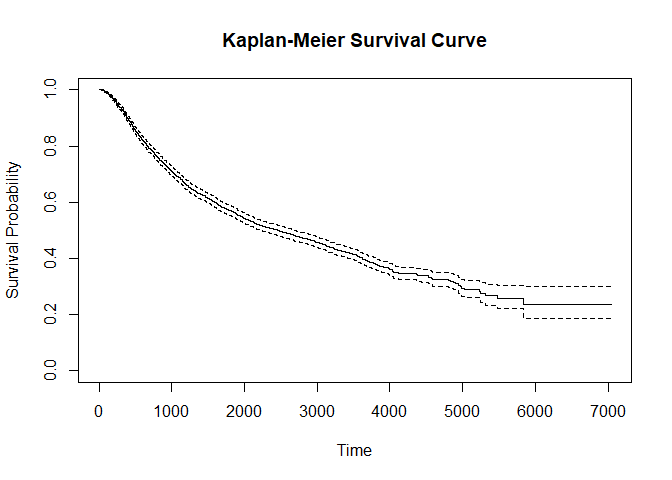

K-M estimation part
================
Zhezheng Jin
2023-11-28

## discription in two treatment

``` r
head(rotterdam)
```

    ##      pid year age meno  size grade nodes pgr  er hormon chemo rtime recur dtime
    ## 1393   1 1992  74    1  <=20     3     0  35 291      0     0  1799     0  1799
    ## 1416   2 1984  79    1 20-50     3     0  36 611      0     0  2828     0  2828
    ## 2962   3 1983  44    0  <=20     2     0 138   0      0     0  6012     0  6012
    ## 1455   4 1985  70    1 20-50     3     0   0  12      0     0  2624     0  2624
    ## 977    5 1983  75    1  <=20     3     0 260 409      0     0  4915     0  4915
    ## 617    6 1983  52    0  <=20     3     0 139 303      0     0  5888     0  5888
    ##      death
    ## 1393     0
    ## 1416     0
    ## 2962     0
    ## 1455     0
    ## 977      0
    ## 617      0

``` r
Rotterdam=data.frame(rotterdam)
summary(Rotterdam)
```

    ##       pid              year           age             meno         size     
    ##  Min.   :   1.0   Min.   :1978   Min.   :24.00   Min.   :0.00   <=20 :1387  
    ##  1st Qu.: 753.2   1st Qu.:1986   1st Qu.:45.00   1st Qu.:0.00   20-50:1291  
    ##  Median :1504.5   Median :1988   Median :54.00   Median :1.00   >50  : 304  
    ##  Mean   :1505.0   Mean   :1988   Mean   :55.06   Mean   :0.56               
    ##  3rd Qu.:2254.8   3rd Qu.:1990   3rd Qu.:65.00   3rd Qu.:1.00               
    ##  Max.   :3007.0   Max.   :1993   Max.   :90.00   Max.   :1.00               
    ##      grade           nodes             pgr               er        
    ##  Min.   :2.000   Min.   : 0.000   Min.   :   0.0   Min.   :   0.0  
    ##  1st Qu.:2.000   1st Qu.: 0.000   1st Qu.:   4.0   1st Qu.:  11.0  
    ##  Median :3.000   Median : 1.000   Median :  41.0   Median :  61.0  
    ##  Mean   :2.734   Mean   : 2.712   Mean   : 161.8   Mean   : 166.6  
    ##  3rd Qu.:3.000   3rd Qu.: 4.000   3rd Qu.: 198.0   3rd Qu.: 202.8  
    ##  Max.   :3.000   Max.   :34.000   Max.   :5004.0   Max.   :3275.0  
    ##      hormon           chemo            rtime            recur       
    ##  Min.   :0.0000   Min.   :0.0000   Min.   :  36.0   Min.   :0.0000  
    ##  1st Qu.:0.0000   1st Qu.:0.0000   1st Qu.: 823.5   1st Qu.:0.0000  
    ##  Median :0.0000   Median :0.0000   Median :1940.0   Median :1.0000  
    ##  Mean   :0.1137   Mean   :0.1945   Mean   :2097.9   Mean   :0.5091  
    ##  3rd Qu.:0.0000   3rd Qu.:0.0000   3rd Qu.:3198.8   3rd Qu.:1.0000  
    ##  Max.   :1.0000   Max.   :1.0000   Max.   :7043.0   Max.   :1.0000  
    ##      dtime          death       
    ##  Min.   :  36   Min.   :0.0000  
    ##  1st Qu.:1607   1st Qu.:0.0000  
    ##  Median :2638   Median :0.0000  
    ##  Mean   :2605   Mean   :0.4266  
    ##  3rd Qu.:3555   3rd Qu.:1.0000  
    ##  Max.   :7043   Max.   :1.0000

``` r
str(Rotterdam)
```

    ## 'data.frame':    2982 obs. of  15 variables:
    ##  $ pid   : int  1 2 3 4 5 6 7 8 9 10 ...
    ##  $ year  : int  1992 1984 1983 1985 1983 1983 1993 1988 1988 1988 ...
    ##  $ age   : int  74 79 44 70 75 52 40 53 60 52 ...
    ##  $ meno  : int  1 1 0 1 1 0 0 1 1 0 ...
    ##  $ size  : Factor w/ 3 levels "<=20","20-50",..: 1 2 1 2 1 1 1 1 1 2 ...
    ##  $ grade : int  3 3 2 3 3 3 2 2 2 3 ...
    ##  $ nodes : int  0 0 0 0 0 0 0 0 0 5 ...
    ##  $ pgr   : int  35 36 138 0 260 139 13 1 627 316 ...
    ##  $ er    : int  291 611 0 12 409 303 4 4 151 976 ...
    ##  $ hormon: int  0 0 0 0 0 0 0 0 0 0 ...
    ##  $ chemo : int  0 0 0 0 0 0 0 0 0 0 ...
    ##  $ rtime : num  1799 2828 6012 2624 4915 ...
    ##  $ recur : int  0 0 0 0 0 0 0 0 0 0 ...
    ##  $ dtime : num  1799 2828 6012 2624 4915 ...
    ##  $ death : int  0 0 0 0 0 0 0 0 0 0 ...

``` r
description_table <- data.frame(
  Characteristic = c("age24-45", "age46-65", "meno=1", 
                     "size<=20", "size20-50", "grade=2", 
                     "nodes<4", "pgr<200", "er<200", "chemo=1"),
  Overall = c(
    sum(Rotterdam$age >= 24 & Rotterdam$age <= 45),
    sum(Rotterdam$age > 45 & Rotterdam$age <= 65),
    sum(Rotterdam$meno == 1),
    sum(Rotterdam$size=="<=20"),
    sum(Rotterdam$size =="20-50"),
    sum(Rotterdam$grade == 2),
    sum(Rotterdam$nodes < 4),
    sum(Rotterdam$pgr < 200),
    sum(Rotterdam$er < 200),
    sum(Rotterdam$chemo == 1)
  ),
  Treat0 = c(
    sum(Rotterdam$age >= 24 & Rotterdam$age <= 45 & Rotterdam$hormon == 0),
    sum(Rotterdam$age > 45 & Rotterdam$age <= 65 & Rotterdam$hormon == 0),
    sum(Rotterdam$meno == 1 & Rotterdam$hormon == 0),
    sum(Rotterdam$size=="<=20" & Rotterdam$hormon == 0),
    sum(Rotterdam$size =="20-50" & Rotterdam$hormon == 0),
    sum(Rotterdam$grade == 2 & Rotterdam$hormon == 0),
    sum(Rotterdam$nodes < 4 & Rotterdam$hormon == 0),
    sum(Rotterdam$pgr < 200 & Rotterdam$hormon == 0),
    sum(Rotterdam$er < 200 & Rotterdam$hormon == 0),
    sum(Rotterdam$chemo == 1 & Rotterdam$hormon == 0)
  ),
  Treat1 = c(
    sum(Rotterdam$age >= 24 & Rotterdam$age <= 45 & Rotterdam$hormon == 1),
    sum(Rotterdam$age > 45 & Rotterdam$age <= 65 & Rotterdam$hormon == 1),
    sum(Rotterdam$meno == 1 & Rotterdam$hormon == 1),
    sum(Rotterdam$size=="<=20" & Rotterdam$hormon == 1),
    sum(Rotterdam$size =="20-50"& Rotterdam$hormon == 1),
    sum(Rotterdam$grade == 2 & Rotterdam$hormon == 1),
    sum(Rotterdam$nodes < 4 & Rotterdam$hormon == 1),
    sum(Rotterdam$pgr < 200 & Rotterdam$hormon == 1),
    sum(Rotterdam$er < 200 & Rotterdam$hormon == 1),
    sum(Rotterdam$chemo == 1 & Rotterdam$hormon == 1)
  )
)

print(description_table)
```

    ##    Characteristic Overall Treat0 Treat1
    ## 1        age24-45     783    769     14
    ## 2        age46-65    1472   1277    195
    ## 3          meno=1    1670   1372    298
    ## 4        size<=20    1387   1283    104
    ## 5       size20-50    1291   1119    172
    ## 6         grade=2     794    735     59
    ## 7         nodes<4    2200   2061    139
    ## 8         pgr<200    2240   1956    284
    ## 9          er<200    2229   1987    242
    ## 10        chemo=1     580    552     28

## summary of variables

``` r
char_table <- data.frame(
  Characteristic = c("year", "age", "meno", "grade", "nodes", "pgr", "er", "hormon", "chemo", "rtime", "recur", "dtime", "death"),
  Mean = NA,
  Median = NA,
  Min = NA,
  Max = NA,
  Sd = NA
)


for (i in 1:nrow(char_table)) {
  var_name <- char_table$Characteristic[i]
  char_table$Mean[i] <- mean(Rotterdam[[var_name]], na.rm = TRUE)
  char_table$Median[i] <- median(Rotterdam[[var_name]], na.rm = TRUE)
  char_table$Min[i] <- min(Rotterdam[[var_name]], na.rm = TRUE)
  char_table$Max[i] <- max(Rotterdam[[var_name]], na.rm = TRUE)
  char_table$Sd[i] <- sd(Rotterdam[[var_name]], na.rm = TRUE)
}

char_table
```

    ##    Characteristic         Mean Median  Min  Max           Sd
    ## 1            year 1988.1613011 1988.0 1978 1993    3.0354837
    ## 2             age   55.0583501   54.0   24   90   12.9529876
    ## 3            meno    0.5600268    1.0    0    1    0.4964670
    ## 4           grade    2.7337357    3.0    2    3    0.4420782
    ## 5           nodes    2.7122736    1.0    0   34    4.3838444
    ## 6             pgr  161.8313213   41.0    0 5004  291.3110759
    ## 7              er  166.5895372   61.0    0 3275  272.4654859
    ## 8          hormon    0.1136821    0.0    0    1    0.3174780
    ## 9           chemo    0.1945003    0.0    0    1    0.3958819
    ## 10          rtime 2097.9037559 1940.0   36 7043 1397.7118911
    ## 11          recur    0.5090543    1.0    0    1    0.5000019
    ## 12          dtime 2605.3400402 2638.5   36 7043 1298.0775535
    ## 13          death    0.4265594    0.0    0    1    0.4946600

## KM estimation

``` r
status  <- pmax(rotterdam$recur, rotterdam$death)
rfstime <- with(rotterdam, ifelse(recur==1, rtime, dtime))
fit1 <- coxph(Surv(rfstime, status) ~ pspline(age) + meno + size + 
        pspline(nodes) + er,
     data=rotterdam, subset = (nodes > 0))
summary(fit1)
```

    ## Call:
    ## coxph(formula = Surv(rfstime, status) ~ pspline(age) + meno + 
    ##     size + pspline(nodes) + er, data = rotterdam, subset = (nodes > 
    ##     0))
    ## 
    ##   n= 1546, number of events= 1080 
    ## 
    ##                        coef       se(coef)  se2      Chisq  DF   p      
    ## pspline(age), linear    0.0013046 0.0038282 0.003826   0.12 1.00 7.3e-01
    ## pspline(age), nonlin                                  16.58 3.08 9.4e-04
    ## meno                    0.3439648 0.1298336 0.124581   7.02 1.00 8.1e-03
    ## size20-50               0.2429536 0.0738585 0.073764  10.82 1.00 1.0e-03
    ## size>50                 0.5061899 0.0954152 0.095209  28.14 1.00 1.1e-07
    ## pspline(nodes), linear  0.0622802 0.0061756 0.006153 101.71 1.00 6.4e-24
    ## pspline(nodes), nonlin                                51.94 3.05 3.4e-11
    ## er                     -0.0002761 0.0001232 0.000123   5.02 1.00 2.5e-02
    ## 
    ##             exp(coef) exp(-coef) lower .95 upper .95
    ## ps(age)3       1.0423     0.9594    0.5715     1.901
    ## ps(age)4       1.0884     0.9188    0.4189     2.828
    ## ps(age)5       1.0374     0.9640    0.3550     3.031
    ## ps(age)6       0.8442     1.1845    0.2916     2.444
    ## ps(age)7       0.7276     1.3744    0.2553     2.074
    ## ps(age)8       0.7316     1.3669    0.2529     2.117
    ## ps(age)9       0.7231     1.3829    0.2470     2.117
    ## ps(age)10      0.7310     1.3679    0.2497     2.140
    ## ps(age)11      0.8835     1.1318    0.3012     2.592
    ## ps(age)12      1.1358     0.8804    0.3784     3.409
    ## ps(age)13      1.4546     0.6875    0.4307     4.913
    ## ps(age)14      1.8713     0.5344    0.4082     8.580
    ## meno           1.4105     0.7090    1.0936     1.819
    ## size20-50      1.2750     0.7843    1.1032     1.474
    ## size>50        1.6590     0.6028    1.3760     2.000
    ## ps(nodes)3     1.9870     0.5033    1.1567     3.413
    ## ps(nodes)4     3.7615     0.2659    1.9044     7.430
    ## ps(nodes)5     5.6603     0.1767    2.9794    10.753
    ## ps(nodes)6     7.1670     0.1395    3.8063    13.495
    ## ps(nodes)7     7.4269     0.1346    3.8942    14.165
    ## ps(nodes)8     7.0286     0.1423    3.5928    13.750
    ## ps(nodes)9     6.3944     0.1564    3.1704    12.897
    ## ps(nodes)10    5.9968     0.1668    2.8612    12.569
    ## ps(nodes)11    6.2184     0.1608    2.7429    14.097
    ## ps(nodes)12    6.9446     0.1440    2.6851    17.962
    ## ps(nodes)13    8.2802     0.1208    2.4257    28.266
    ## ps(nodes)14    9.9986     0.1000    1.7687    56.525
    ## er             0.9997     1.0003    0.9995     1.000
    ## 
    ## Iterations: 6 outer, 17 Newton-Raphson
    ##      Theta= 0.9576637 
    ##      Theta= 0.9391805 
    ## Degrees of freedom for terms= 4.1 0.9 2.0 4.1 1.0 
    ## Concordance= 0.667  (se = 0.009 )
    ## Likelihood ratio test= 291.9  on 12.04 df,   p=<2e-16

``` r
fit1_surv <- survfit(fit1)

# 绘制Kaplan-Meier估计图
plot(fit1_surv, main = "Kaplan-Meier Estimate", xlab = "Time", ylab = "Survival Probability")
```

<!-- -->

``` r
surv_obj <- Surv(time = rfstime, event = status)

# 进行Kaplan-Meier生存估计
km_fit <- survfit(surv_obj ~ 1)
summary(km_fit)
```

    ## Call: survfit(formula = surv_obj ~ 1)
    ## 
    ##  time n.risk n.event survival  std.err lower 95% CI upper 95% CI
    ##    38   2981       1    1.000 0.000335        0.999        1.000
    ##    45   2980       1    0.999 0.000474        0.998        1.000
    ##    49   2979       1    0.999 0.000581        0.998        1.000
    ##    50   2978       1    0.999 0.000670        0.997        1.000
    ##    64   2977       2    0.998 0.000821        0.996        1.000
    ##    65   2975       1    0.998 0.000886        0.996        0.999
    ##    71   2974       1    0.997 0.000948        0.995        0.999
    ##    74   2973       1    0.997 0.001005        0.995        0.999
    ##    75   2972       1    0.997 0.001059        0.995        0.999
    ##    76   2971       1    0.996 0.001111        0.994        0.998
    ##    77   2970       2    0.996 0.001207        0.993        0.998
    ##    78   2968       1    0.995 0.001252        0.993        0.998
    ##    79   2967       1    0.995 0.001296        0.992        0.998
    ##    83   2966       1    0.995 0.001338        0.992        0.997
    ##    86   2965       1    0.994 0.001379        0.992        0.997
    ##    87   2964       1    0.994 0.001419        0.991        0.997
    ##    93   2963       2    0.993 0.001495        0.990        0.996
    ##    96   2961       1    0.993 0.001532        0.990        0.996
    ##    97   2960       1    0.993 0.001568        0.990        0.996
    ##    98   2959       1    0.992 0.001603        0.989        0.995
    ##   100   2958       1    0.992 0.001637        0.989        0.995
    ##   101   2957       2    0.991 0.001703        0.988        0.995
    ##   103   2954       1    0.991 0.001735        0.988        0.994
    ##   105   2953       1    0.991 0.001767        0.987        0.994
    ##   106   2952       1    0.990 0.001798        0.987        0.994
    ##   108   2951       1    0.990 0.001828        0.986        0.994
    ##   110   2950       1    0.990 0.001858        0.986        0.993
    ##   114   2949       1    0.989 0.001888        0.986        0.993
    ##   116   2948       2    0.989 0.001945        0.985        0.992
    ##   117   2946       2    0.988 0.002001        0.984        0.992
    ##   120   2944       1    0.988 0.002028        0.984        0.992
    ##   121   2943       1    0.987 0.002055        0.983        0.991
    ##   122   2942       1    0.987 0.002081        0.983        0.991
    ##   127   2940       1    0.987 0.002108        0.982        0.991
    ##   128   2939       1    0.986 0.002133        0.982        0.990
    ##   129   2938       3    0.985 0.002209        0.981        0.990
    ##   130   2935       1    0.985 0.002234        0.981        0.989
    ##   133   2934       1    0.985 0.002258        0.980        0.989
    ##   134   2933       1    0.984 0.002282        0.980        0.989
    ##   137   2932       2    0.984 0.002329        0.979        0.988
    ##   138   2930       1    0.983 0.002353        0.979        0.988
    ##   140   2929       1    0.983 0.002376        0.978        0.988
    ##   142   2928       1    0.983 0.002398        0.978        0.987
    ##   147   2927       1    0.982 0.002421        0.977        0.987
    ##   151   2926       2    0.982 0.002465        0.977        0.986
    ##   152   2924       1    0.981 0.002487        0.976        0.986
    ##   154   2923       1    0.981 0.002509        0.976        0.986
    ##   155   2922       1    0.981 0.002531        0.976        0.986
    ##   160   2921       1    0.980 0.002552        0.975        0.985
    ##   162   2919       1    0.980 0.002573        0.975        0.985
    ##   163   2918       1    0.980 0.002594        0.974        0.985
    ##   166   2916       1    0.979 0.002615        0.974        0.984
    ##   167   2915       2    0.979 0.002656        0.973        0.984
    ##   168   2913       2    0.978 0.002696        0.973        0.983
    ##   169   2911       1    0.978 0.002716        0.972        0.983
    ##   171   2910       1    0.977 0.002736        0.972        0.983
    ##   172   2909       2    0.977 0.002775        0.971        0.982
    ##   173   2907       1    0.976 0.002794        0.971        0.982
    ##   175   2906       2    0.975 0.002832        0.970        0.981
    ##   176   2904       1    0.975 0.002851        0.970        0.981
    ##   177   2903       4    0.974 0.002925        0.968        0.980
    ##   179   2899       1    0.973 0.002943        0.968        0.979
    ##   181   2898       1    0.973 0.002962        0.967        0.979
    ##   182   2897       2    0.972 0.002997        0.967        0.978
    ##   186   2895       4    0.971 0.003068        0.965        0.977
    ##   188   2891       1    0.971 0.003085        0.965        0.977
    ##   189   2890       3    0.970 0.003136        0.964        0.976
    ##   195   2887       1    0.969 0.003153        0.963        0.976
    ##   197   2886       2    0.969 0.003186        0.963        0.975
    ##   199   2884       1    0.968 0.003203        0.962        0.975
    ##   202   2883       1    0.968 0.003219        0.962        0.974
    ##   203   2882       2    0.967 0.003252        0.961        0.974
    ##   205   2880       2    0.967 0.003284        0.960        0.973
    ##   206   2878       2    0.966 0.003316        0.960        0.973
    ##   207   2876       1    0.966 0.003332        0.959        0.972
    ##   208   2875       2    0.965 0.003363        0.959        0.972
    ##   209   2873       1    0.965 0.003379        0.958        0.971
    ##   212   2872       2    0.964 0.003410        0.957        0.971
    ##   215   2870       2    0.963 0.003440        0.957        0.970
    ##   216   2868       1    0.963 0.003455        0.956        0.970
    ##   217   2867       3    0.962 0.003501        0.955        0.969
    ##   218   2864       1    0.962 0.003515        0.955        0.969
    ##   219   2863       1    0.961 0.003530        0.954        0.968
    ##   220   2862       1    0.961 0.003545        0.954        0.968
    ##   223   2861       1    0.961 0.003560        0.954        0.968
    ##   225   2860       2    0.960 0.003589        0.953        0.967
    ##   226   2858       1    0.960 0.003603        0.953        0.967
    ##   227   2857       2    0.959 0.003632        0.952        0.966
    ##   229   2855       2    0.958 0.003660        0.951        0.966
    ##   231   2853       2    0.958 0.003688        0.950        0.965
    ##   232   2851       1    0.957 0.003702        0.950        0.965
    ##   235   2850       1    0.957 0.003716        0.950        0.964
    ##   238   2849       2    0.956 0.003744        0.949        0.964
    ##   239   2847       3    0.955 0.003785        0.948        0.963
    ##   240   2844       1    0.955 0.003798        0.948        0.962
    ##   241   2843       1    0.955 0.003812        0.947        0.962
    ##   242   2842       4    0.953 0.003865        0.946        0.961
    ##   243   2838       1    0.953 0.003878        0.945        0.961
    ##   245   2837       2    0.952 0.003905        0.945        0.960
    ##   246   2835       4    0.951 0.003956        0.943        0.959
    ##   247   2831       2    0.950 0.003982        0.943        0.958
    ##   248   2829       1    0.950 0.003995        0.942        0.958
    ##   251   2828       3    0.949 0.004033        0.941        0.957
    ##   253   2825       1    0.949 0.004045        0.941        0.957
    ##   255   2824       2    0.948 0.004070        0.940        0.956
    ##   256   2822       1    0.948 0.004083        0.940        0.956
    ##   257   2821       1    0.947 0.004095        0.939        0.955
    ##   258   2820       2    0.947 0.004120        0.939        0.955
    ##   259   2818       2    0.946 0.004144        0.938        0.954
    ##   260   2816       4    0.945 0.004192        0.936        0.953
    ##   261   2812       1    0.944 0.004204        0.936        0.953
    ##   264   2811       1    0.944 0.004216        0.936        0.952
    ##   268   2810       1    0.944 0.004228        0.935        0.952
    ##   270   2809       1    0.943 0.004240        0.935        0.952
    ##   271   2808       1    0.943 0.004251        0.935        0.951
    ##   272   2807       1    0.943 0.004263        0.934        0.951
    ##   274   2806       1    0.942 0.004275        0.934        0.951
    ##   277   2805       1    0.942 0.004286        0.934        0.950
    ##   278   2804       2    0.941 0.004310        0.933        0.950
    ##   279   2802       3    0.940 0.004344        0.932        0.949
    ##   280   2799       1    0.940 0.004356        0.931        0.948
    ##   283   2798       1    0.940 0.004367        0.931        0.948
    ##   285   2797       1    0.939 0.004378        0.931        0.948
    ##   286   2796       3    0.938 0.004412        0.930        0.947
    ##   288   2793       1    0.938 0.004423        0.929        0.947
    ##   290   2792       1    0.938 0.004434        0.929        0.946
    ##   292   2791       1    0.937 0.004446        0.929        0.946
    ##   294   2790       2    0.937 0.004468        0.928        0.945
    ##   297   2788       1    0.936 0.004479        0.927        0.945
    ##   298   2786       1    0.936 0.004490        0.927        0.945
    ##   300   2785       1    0.936 0.004501        0.927        0.944
    ##   301   2784       3    0.935 0.004533        0.926        0.943
    ##   302   2781       2    0.934 0.004555        0.925        0.943
    ##   303   2779       1    0.934 0.004566        0.925        0.943
    ##   305   2778       1    0.933 0.004576        0.924        0.942
    ##   306   2777       1    0.933 0.004587        0.924        0.942
    ##   309   2776       1    0.933 0.004598        0.924        0.942
    ##   310   2775       1    0.932 0.004608        0.923        0.941
    ##   313   2774       3    0.931 0.004640        0.922        0.940
    ##   314   2771       1    0.931 0.004650        0.922        0.940
    ##   315   2770       2    0.930 0.004671        0.921        0.939
    ##   316   2768       1    0.930 0.004682        0.921        0.939
    ##   318   2767       1    0.929 0.004692        0.920        0.939
    ##   319   2766       1    0.929 0.004702        0.920        0.938
    ##   320   2765       1    0.929 0.004713        0.920        0.938
    ##   322   2764       1    0.928 0.004723        0.919        0.938
    ##   324   2763       2    0.928 0.004743        0.919        0.937
    ##   328   2761       1    0.927 0.004753        0.918        0.937
    ##   330   2760       1    0.927 0.004764        0.918        0.937
    ##   332   2759       2    0.926 0.004784        0.917        0.936
    ##   333   2757       5    0.925 0.004834        0.915        0.934
    ##   334   2752       1    0.924 0.004844        0.915        0.934
    ##   335   2751       1    0.924 0.004853        0.915        0.934
    ##   337   2750       3    0.923 0.004883        0.914        0.933
    ##   338   2747       1    0.923 0.004893        0.913        0.932
    ##   340   2746       2    0.922 0.004912        0.913        0.932
    ##   342   2744       2    0.921 0.004932        0.912        0.931
    ##   343   2742       2    0.921 0.004951        0.911        0.930
    ##   344   2740       2    0.920 0.004970        0.910        0.930
    ##   345   2738       1    0.920 0.004979        0.910        0.930
    ##   346   2737       1    0.919 0.004989        0.910        0.929
    ##   348   2735       1    0.919 0.004998        0.909        0.929
    ##   349   2734       2    0.918 0.005017        0.909        0.928
    ##   350   2732       2    0.918 0.005036        0.908        0.928
    ##   351   2730       1    0.917 0.005046        0.908        0.927
    ##   353   2729       1    0.917 0.005055        0.907        0.927
    ##   354   2727       2    0.916 0.005073        0.906        0.926
    ##   356   2725       1    0.916 0.005083        0.906        0.926
    ##   357   2724       3    0.915 0.005110        0.905        0.925
    ##   359   2721       2    0.914 0.005129        0.904        0.924
    ##   360   2719       1    0.914 0.005138        0.904        0.924
    ##   361   2718       3    0.913 0.005165        0.903        0.923
    ##   362   2715       1    0.913 0.005174        0.903        0.923
    ##   364   2714       1    0.912 0.005183        0.902        0.923
    ##   365   2713       4    0.911 0.005219        0.901        0.921
    ##   366   2709       1    0.911 0.005228        0.900        0.921
    ##   368   2708       3    0.910 0.005254        0.899        0.920
    ##   372   2705       1    0.909 0.005263        0.899        0.920
    ##   373   2704       2    0.909 0.005281        0.898        0.919
    ##   375   2702       2    0.908 0.005298        0.898        0.918
    ##   376   2700       3    0.907 0.005324        0.897        0.917
    ##   378   2697       2    0.906 0.005342        0.896        0.917
    ##   379   2695       4    0.905 0.005376        0.894        0.916
    ##   381   2691       4    0.904 0.005410        0.893        0.914
    ##   382   2687       2    0.903 0.005427        0.892        0.914
    ##   383   2685       2    0.902 0.005443        0.892        0.913
    ##   384   2683       2    0.902 0.005460        0.891        0.912
    ##   385   2681       2    0.901 0.005477        0.890        0.912
    ##   387   2679       1    0.901 0.005485        0.890        0.911
    ##   388   2678       1    0.900 0.005493        0.890        0.911
    ##   389   2677       1    0.900 0.005501        0.889        0.911
    ##   390   2676       1    0.900 0.005510        0.889        0.910
    ##   392   2675       1    0.899 0.005518        0.888        0.910
    ##   393   2674       1    0.899 0.005526        0.888        0.910
    ##   394   2673       3    0.898 0.005550        0.887        0.909
    ##   395   2670       1    0.898 0.005558        0.887        0.908
    ##   396   2669       1    0.897 0.005566        0.886        0.908
    ##   397   2668       2    0.897 0.005583        0.886        0.908
    ##   399   2666       1    0.896 0.005591        0.885        0.907
    ##   400   2665       1    0.896 0.005599        0.885        0.907
    ##   401   2664       2    0.895 0.005615        0.884        0.906
    ##   402   2662       1    0.895 0.005623        0.884        0.906
    ##   403   2661       2    0.894 0.005638        0.883        0.905
    ##   405   2659       1    0.894 0.005646        0.883        0.905
    ##   407   2658       1    0.894 0.005654        0.882        0.905
    ##   408   2657       1    0.893 0.005662        0.882        0.904
    ##   409   2656       1    0.893 0.005670        0.882        0.904
    ##   410   2655       1    0.892 0.005678        0.881        0.904
    ##   412   2654       2    0.892 0.005693        0.881        0.903
    ##   413   2652       1    0.891 0.005701        0.880        0.903
    ##   414   2651       3    0.890 0.005724        0.879        0.902
    ##   416   2648       1    0.890 0.005732        0.879        0.901
    ##   419   2647       1    0.890 0.005740        0.879        0.901
    ##   420   2646       2    0.889 0.005755        0.878        0.900
    ##   422   2644       1    0.889 0.005763        0.878        0.900
    ##   423   2643       2    0.888 0.005778        0.877        0.900
    ##   426   2641       1    0.888 0.005785        0.877        0.899
    ##   427   2640       2    0.887 0.005801        0.876        0.899
    ##   428   2638       2    0.886 0.005816        0.875        0.898
    ##   429   2636       1    0.886 0.005823        0.875        0.898
    ##   432   2635       1    0.886 0.005831        0.874        0.897
    ##   433   2634       3    0.885 0.005853        0.873        0.896
    ##   434   2631       2    0.884 0.005868        0.873        0.896
    ##   436   2628       1    0.884 0.005875        0.872        0.895
    ##   437   2627       2    0.883 0.005890        0.872        0.895
    ##   438   2625       1    0.883 0.005897        0.871        0.894
    ##   439   2624       1    0.882 0.005905        0.871        0.894
    ##   440   2623       1    0.882 0.005912        0.871        0.894
    ##   442   2622       1    0.882 0.005919        0.870        0.893
    ##   443   2621       2    0.881 0.005934        0.870        0.893
    ##   445   2619       1    0.881 0.005941        0.869        0.892
    ##   446   2618       1    0.880 0.005948        0.869        0.892
    ##   447   2617       1    0.880 0.005956        0.868        0.892
    ##   448   2616       1    0.880 0.005963        0.868        0.891
    ##   449   2615       4    0.878 0.005992        0.867        0.890
    ##   450   2611       2    0.878 0.006006        0.866        0.890
    ##   451   2609       2    0.877 0.006020        0.865        0.889
    ##   454   2607       2    0.876 0.006034        0.865        0.888
    ##   455   2605       2    0.876 0.006048        0.864        0.888
    ##   456   2603       2    0.875 0.006062        0.863        0.887
    ##   457   2601       1    0.875 0.006069        0.863        0.887
    ##   458   2600       2    0.874 0.006083        0.862        0.886
    ##   460   2598       1    0.874 0.006090        0.862        0.886
    ##   461   2597       2    0.873 0.006104        0.861        0.885
    ##   462   2595       1    0.873 0.006111        0.861        0.885
    ##   463   2594       3    0.872 0.006132        0.860        0.884
    ##   464   2591       1    0.871 0.006139        0.859        0.883
    ##   465   2590       2    0.871 0.006152        0.859        0.883
    ##   466   2588       1    0.870 0.006159        0.858        0.882
    ##   468   2587       2    0.870 0.006173        0.858        0.882
    ##   470   2585       3    0.869 0.006193        0.857        0.881
    ##   471   2582       1    0.868 0.006200        0.856        0.881
    ##   472   2581       2    0.868 0.006213        0.856        0.880
    ##   473   2579       2    0.867 0.006226        0.855        0.879
    ##   474   2577       3    0.866 0.006246        0.854        0.878
    ##   475   2574       1    0.866 0.006253        0.853        0.878
    ##   476   2573       2    0.865 0.006266        0.853        0.877
    ##   477   2571       4    0.864 0.006292        0.851        0.876
    ##   478   2567       1    0.863 0.006299        0.851        0.876
    ##   479   2566       1    0.863 0.006306        0.851        0.875
    ##   482   2565       1    0.863 0.006312        0.850        0.875
    ##   483   2563       3    0.862 0.006332        0.849        0.874
    ##   485   2560       1    0.861 0.006338        0.849        0.874
    ##   486   2559       1    0.861 0.006344        0.849        0.873
    ##   487   2558       1    0.861 0.006351        0.848        0.873
    ##   489   2557       1    0.860 0.006357        0.848        0.873
    ##   491   2556       4    0.859 0.006383        0.846        0.871
    ##   496   2552       2    0.858 0.006396        0.846        0.871
    ##   497   2550       1    0.858 0.006402        0.845        0.870
    ##   499   2549       1    0.858 0.006408        0.845        0.870
    ##   500   2548       1    0.857 0.006415        0.845        0.870
    ##   502   2547       2    0.856 0.006427        0.844        0.869
    ##   503   2545       4    0.855 0.006452        0.843        0.868
    ##   504   2541       2    0.854 0.006465        0.842        0.867
    ##   505   2539       2    0.854 0.006477        0.841        0.867
    ##   506   2537       2    0.853 0.006489        0.841        0.866
    ##   510   2535       1    0.853 0.006496        0.840        0.866
    ##   511   2534       1    0.852 0.006502        0.840        0.865
    ##   512   2533       2    0.852 0.006514        0.839        0.865
    ##   514   2531       2    0.851 0.006526        0.838        0.864
    ##   515   2529       1    0.851 0.006532        0.838        0.864
    ##   517   2528       1    0.850 0.006538        0.838        0.863
    ##   518   2527       1    0.850 0.006544        0.837        0.863
    ##   519   2526       4    0.849 0.006569        0.836        0.862
    ##   523   2522       2    0.848 0.006581        0.835        0.861
    ##   525   2520       1    0.848 0.006587        0.835        0.861
    ##   526   2519       2    0.847 0.006599        0.834        0.860
    ##   527   2517       3    0.846 0.006616        0.833        0.859
    ##   529   2514       1    0.846 0.006622        0.833        0.859
    ##   531   2513       1    0.845 0.006628        0.833        0.858
    ##   533   2512       1    0.845 0.006634        0.832        0.858
    ##   534   2511       1    0.845 0.006640        0.832        0.858
    ##   535   2510       1    0.844 0.006646        0.831        0.858
    ##   536   2509       1    0.844 0.006652        0.831        0.857
    ##   537   2508       1    0.844 0.006658        0.831        0.857
    ##   538   2507       3    0.843 0.006675        0.830        0.856
    ##   539   2504       1    0.842 0.006681        0.829        0.856
    ##   542   2503       2    0.842 0.006693        0.829        0.855
    ##   543   2501       1    0.841 0.006698        0.828        0.855
    ##   544   2500       1    0.841 0.006704        0.828        0.854
    ##   545   2499       1    0.841 0.006710        0.828        0.854
    ##   546   2498       3    0.840 0.006727        0.827        0.853
    ##   547   2495       2    0.839 0.006738        0.826        0.852
    ##   548   2493       2    0.838 0.006750        0.825        0.852
    ##   552   2491       3    0.837 0.006767        0.824        0.851
    ##   555   2487       2    0.837 0.006778        0.823        0.850
    ##   556   2485       3    0.836 0.006795        0.822        0.849
    ##   557   2481       1    0.835 0.006801        0.822        0.849
    ##   560   2480       1    0.835 0.006806        0.822        0.848
    ##   562   2479       1    0.835 0.006812        0.821        0.848
    ##   563   2478       1    0.834 0.006817        0.821        0.848
    ##   564   2477       2    0.834 0.006828        0.820        0.847
    ##   566   2475       1    0.833 0.006834        0.820        0.847
    ##   568   2474       1    0.833 0.006840        0.820        0.846
    ##   570   2473       1    0.833 0.006845        0.819        0.846
    ##   571   2472       4    0.831 0.006867        0.818        0.845
    ##   572   2468       3    0.830 0.006883        0.817        0.844
    ##   575   2465       3    0.829 0.006900        0.816        0.843
    ##   576   2462       2    0.829 0.006911        0.815        0.842
    ##   582   2458       2    0.828 0.006921        0.814        0.842
    ##   583   2456       5    0.826 0.006948        0.813        0.840
    ##   584   2451       1    0.826 0.006954        0.812        0.840
    ##   585   2450       3    0.825 0.006969        0.811        0.839
    ##   586   2447       1    0.825 0.006975        0.811        0.838
    ##   587   2446       1    0.824 0.006980        0.811        0.838
    ##   589   2445       1    0.824 0.006985        0.810        0.838
    ##   590   2444       1    0.824 0.006991        0.810        0.837
    ##   591   2443       1    0.823 0.006996        0.810        0.837
    ##   592   2442       1    0.823 0.007001        0.809        0.837
    ##   595   2441       2    0.822 0.007012        0.809        0.836
    ##   599   2439       1    0.822 0.007017        0.808        0.836
    ##   600   2438       1    0.821 0.007022        0.808        0.835
    ##   601   2437       1    0.821 0.007027        0.807        0.835
    ##   602   2436       2    0.820 0.007038        0.807        0.834
    ##   604   2434       1    0.820 0.007043        0.806        0.834
    ##   605   2433       1    0.820 0.007048        0.806        0.834
    ##   608   2432       3    0.819 0.007063        0.805        0.833
    ##   609   2429       1    0.818 0.007069        0.805        0.832
    ##   611   2428       2    0.818 0.007079        0.804        0.832
    ##   612   2426       1    0.817 0.007084        0.804        0.831
    ##   614   2425       1    0.817 0.007089        0.803        0.831
    ##   615   2424       2    0.816 0.007099        0.803        0.830
    ##   619   2422       1    0.816 0.007104        0.802        0.830
    ##   621   2420       2    0.815 0.007114        0.802        0.829
    ##   622   2418       2    0.815 0.007124        0.801        0.829
    ##   623   2416       1    0.814 0.007129        0.801        0.828
    ##   624   2415       1    0.814 0.007134        0.800        0.828
    ##   627   2414       2    0.813 0.007144        0.800        0.828
    ##   628   2412       1    0.813 0.007149        0.799        0.827
    ##   629   2411       1    0.813 0.007154        0.799        0.827
    ##   630   2410       1    0.812 0.007159        0.798        0.827
    ##   631   2409       1    0.812 0.007164        0.798        0.826
    ##   633   2408       1    0.812 0.007169        0.798        0.826
    ##   634   2407       2    0.811 0.007179        0.797        0.825
    ##   635   2405       1    0.811 0.007184        0.797        0.825
    ##   636   2404       1    0.810 0.007189        0.796        0.825
    ##   638   2403       2    0.810 0.007199        0.796        0.824
    ##   640   2401       1    0.809 0.007204        0.795        0.824
    ##   641   2400       4    0.808 0.007223        0.794        0.822
    ##   643   2396       1    0.808 0.007228        0.794        0.822
    ##   644   2395       2    0.807 0.007238        0.793        0.821
    ##   645   2393       1    0.807 0.007243        0.793        0.821
    ##   646   2392       1    0.806 0.007247        0.792        0.821
    ##   648   2391       2    0.806 0.007257        0.792        0.820
    ##   649   2389       2    0.805 0.007267        0.791        0.819
    ##   651   2387       4    0.804 0.007286        0.789        0.818
    ##   655   2383       2    0.803 0.007295        0.789        0.817
    ##   656   2380       1    0.803 0.007300        0.788        0.817
    ##   657   2379       1    0.802 0.007305        0.788        0.817
    ##   658   2378       1    0.802 0.007309        0.788        0.816
    ##   659   2377       1    0.802 0.007314        0.787        0.816
    ##   660   2376       1    0.801 0.007319        0.787        0.816
    ##   661   2375       1    0.801 0.007323        0.787        0.815
    ##   663   2374       1    0.801 0.007328        0.786        0.815
    ##   664   2373       2    0.800 0.007337        0.786        0.814
    ##   665   2371       1    0.800 0.007342        0.785        0.814
    ##   667   2370       1    0.799 0.007347        0.785        0.814
    ##   668   2369       2    0.799 0.007356        0.784        0.813
    ##   670   2367       2    0.798 0.007365        0.784        0.812
    ##   671   2365       1    0.798 0.007370        0.783        0.812
    ##   672   2364       2    0.797 0.007379        0.783        0.811
    ##   673   2362       1    0.797 0.007384        0.782        0.811
    ##   675   2361       1    0.796 0.007388        0.782        0.811
    ##   677   2360       3    0.795 0.007402        0.781        0.810
    ##   680   2357       1    0.795 0.007406        0.780        0.809
    ##   681   2356       1    0.795 0.007411        0.780        0.809
    ##   682   2355       1    0.794 0.007416        0.780        0.809
    ##   684   2354       3    0.793 0.007429        0.779        0.808
    ##   686   2351       1    0.793 0.007434        0.778        0.808
    ##   687   2350       2    0.792 0.007443        0.778        0.807
    ##   689   2348       1    0.792 0.007447        0.777        0.807
    ##   691   2347       2    0.791 0.007456        0.777        0.806
    ##   696   2344       1    0.791 0.007460        0.776        0.806
    ##   698   2343       1    0.790 0.007465        0.776        0.805
    ##   699   2342       1    0.790 0.007469        0.776        0.805
    ##   700   2341       2    0.789 0.007478        0.775        0.804
    ##   703   2339       1    0.789 0.007483        0.775        0.804
    ##   705   2338       2    0.788 0.007491        0.774        0.803
    ##   706   2336       1    0.788 0.007496        0.774        0.803
    ##   708   2335       1    0.788 0.007500        0.773        0.803
    ##   713   2334       1    0.787 0.007505        0.773        0.802
    ##   715   2333       1    0.787 0.007509        0.772        0.802
    ##   716   2332       1    0.787 0.007513        0.772        0.802
    ##   719   2331       1    0.786 0.007518        0.772        0.801
    ##   720   2330       1    0.786 0.007522        0.771        0.801
    ##   721   2329       1    0.786 0.007526        0.771        0.801
    ##   722   2328       3    0.785 0.007539        0.770        0.800
    ##   724   2325       1    0.784 0.007544        0.770        0.799
    ##   728   2324       1    0.784 0.007548        0.769        0.799
    ##   730   2323       1    0.784 0.007552        0.769        0.799
    ##   731   2322       2    0.783 0.007561        0.768        0.798
    ##   732   2320       1    0.783 0.007565        0.768        0.798
    ##   735   2319       2    0.782 0.007574        0.767        0.797
    ##   736   2317       1    0.782 0.007578        0.767        0.797
    ##   739   2316       1    0.781 0.007582        0.767        0.796
    ##   741   2315       1    0.781 0.007586        0.766        0.796
    ##   742   2314       4    0.780 0.007603        0.765        0.795
    ##   743   2310       2    0.779 0.007611        0.764        0.794
    ##   744   2308       1    0.779 0.007616        0.764        0.794
    ##   745   2307       1    0.778 0.007620        0.764        0.793
    ##   748   2306       1    0.778 0.007624        0.763        0.793
    ##   751   2305       1    0.778 0.007628        0.763        0.793
    ##   753   2304       1    0.777 0.007632        0.762        0.792
    ##   754   2303       1    0.777 0.007636        0.762        0.792
    ##   755   2302       1    0.777 0.007641        0.762        0.792
    ##   756   2301       1    0.776 0.007645        0.761        0.791
    ##   757   2300       2    0.776 0.007653        0.761        0.791
    ##   758   2298       2    0.775 0.007661        0.760        0.790
    ##   761   2296       1    0.775 0.007665        0.760        0.790
    ##   762   2295       3    0.774 0.007678        0.759        0.789
    ##   763   2292       2    0.773 0.007686        0.758        0.788
    ##   765   2290       1    0.773 0.007690        0.758        0.788
    ##   766   2289       1    0.772 0.007694        0.757        0.787
    ##   767   2288       1    0.772 0.007698        0.757        0.787
    ##   768   2287       1    0.772 0.007702        0.757        0.787
    ##   769   2286       2    0.771 0.007710        0.756        0.786
    ##   771   2284       2    0.770 0.007718        0.755        0.785
    ##   772   2282       2    0.770 0.007726        0.755        0.785
    ##   774   2280       2    0.769 0.007734        0.754        0.784
    ##   775   2278       1    0.769 0.007738        0.753        0.784
    ##   776   2277       2    0.768 0.007746        0.753        0.783
    ##   777   2275       1    0.768 0.007750        0.752        0.783
    ##   778   2274       1    0.767 0.007754        0.752        0.783
    ##   780   2273       1    0.767 0.007757        0.752        0.782
    ##   782   2272       1    0.766 0.007761        0.751        0.782
    ##   783   2271       1    0.766 0.007765        0.751        0.782
    ##   784   2270       1    0.766 0.007769        0.751        0.781
    ##   786   2269       1    0.765 0.007773        0.750        0.781
    ##   787   2268       1    0.765 0.007777        0.750        0.781
    ##   788   2267       1    0.765 0.007781        0.750        0.780
    ##   789   2266       1    0.764 0.007785        0.749        0.780
    ##   791   2265       1    0.764 0.007789        0.749        0.780
    ##   792   2264       1    0.764 0.007793        0.749        0.779
    ##   795   2263       2    0.763 0.007800        0.748        0.779
    ##   797   2260       1    0.763 0.007804        0.748        0.778
    ##   798   2259       3    0.762 0.007816        0.747        0.777
    ##   799   2256       1    0.761 0.007819        0.746        0.777
    ##   803   2255       1    0.761 0.007823        0.746        0.777
    ##   804   2254       1    0.761 0.007827        0.746        0.776
    ##   805   2253       1    0.760 0.007831        0.745        0.776
    ##   809   2252       1    0.760 0.007835        0.745        0.776
    ##   812   2250       1    0.760 0.007838        0.745        0.775
    ##   813   2249       2    0.759 0.007846        0.744        0.775
    ##   814   2247       2    0.758 0.007854        0.743        0.774
    ##   815   2245       1    0.758 0.007857        0.743        0.774
    ##   820   2244       1    0.758 0.007861        0.742        0.773
    ##   821   2243       2    0.757 0.007869        0.742        0.773
    ##   822   2241       1    0.757 0.007872        0.741        0.772
    ##   823   2240       1    0.756 0.007876        0.741        0.772
    ##   825   2239       1    0.756 0.007880        0.741        0.772
    ##   826   2238       1    0.756 0.007884        0.740        0.771
    ##   827   2237       1    0.755 0.007887        0.740        0.771
    ##   828   2236       1    0.755 0.007891        0.740        0.771
    ##   830   2235       2    0.754 0.007898        0.739        0.770
    ##   831   2233       2    0.754 0.007906        0.738        0.769
    ##   832   2231       2    0.753 0.007913        0.738        0.769
    ##   833   2229       5    0.751 0.007931        0.736        0.767
    ##   834   2224       1    0.751 0.007935        0.736        0.767
    ##   835   2223       1    0.751 0.007938        0.735        0.766
    ##   837   2222       1    0.750 0.007942        0.735        0.766
    ##   838   2221       1    0.750 0.007946        0.735        0.766
    ##   839   2220       1    0.750 0.007949        0.734        0.765
    ##   843   2219       1    0.749 0.007953        0.734        0.765
    ##   847   2218       1    0.749 0.007956        0.733        0.765
    ##   849   2217       1    0.749 0.007960        0.733        0.764
    ##   850   2216       1    0.748 0.007964        0.733        0.764
    ##   851   2215       1    0.748 0.007967        0.732        0.764
    ##   852   2213       1    0.748 0.007971        0.732        0.763
    ##   855   2211       1    0.747 0.007974        0.732        0.763
    ##   856   2210       1    0.747 0.007978        0.731        0.763
    ##   857   2209       1    0.747 0.007981        0.731        0.762
    ##   858   2208       2    0.746 0.007989        0.730        0.762
    ##   859   2206       1    0.746 0.007992        0.730        0.761
    ##   866   2205       2    0.745 0.007999        0.729        0.761
    ##   867   2203       2    0.744 0.008006        0.729        0.760
    ##   869   2201       1    0.744 0.008010        0.728        0.760
    ##   870   2200       2    0.743 0.008017        0.728        0.759
    ##   872   2198       1    0.743 0.008020        0.727        0.759
    ##   874   2197       2    0.742 0.008027        0.727        0.758
    ##   876   2195       1    0.742 0.008030        0.726        0.758
    ##   877   2194       2    0.741 0.008037        0.726        0.757
    ##   879   2191       1    0.741 0.008041        0.725        0.757
    ##   880   2190       1    0.740 0.008044        0.725        0.756
    ##   881   2189       2    0.740 0.008051        0.724        0.756
    ##   882   2187       1    0.739 0.008055        0.724        0.755
    ##   883   2186       2    0.739 0.008061        0.723        0.755
    ##   887   2184       1    0.738 0.008065        0.723        0.754
    ##   889   2183       2    0.738 0.008072        0.722        0.754
    ##   891   2181       1    0.737 0.008075        0.722        0.753
    ##   894   2180       1    0.737 0.008078        0.721        0.753
    ##   895   2179       1    0.737 0.008082        0.721        0.753
    ##   897   2178       2    0.736 0.008088        0.720        0.752
    ##   898   2176       1    0.736 0.008092        0.720        0.752
    ##   901   2175       1    0.735 0.008095        0.720        0.751
    ##   902   2174       1    0.735 0.008098        0.719        0.751
    ##   903   2173       1    0.735 0.008102        0.719        0.751
    ##   904   2172       1    0.734 0.008105        0.719        0.750
    ##   906   2170       1    0.734 0.008108        0.718        0.750
    ##   909   2169       1    0.734 0.008112        0.718        0.750
    ##   910   2168       1    0.733 0.008115        0.718        0.749
    ##   911   2167       1    0.733 0.008118        0.717        0.749
    ##   915   2166       1    0.733 0.008122        0.717        0.749
    ##   918   2164       2    0.732 0.008128        0.716        0.748
    ##   920   2162       1    0.732 0.008132        0.716        0.748
    ##   921   2161       1    0.731 0.008135        0.716        0.747
    ##   922   2160       2    0.731 0.008141        0.715        0.747
    ##   923   2158       1    0.730 0.008145        0.715        0.746
    ##   924   2157       1    0.730 0.008148        0.714        0.746
    ##   925   2156       1    0.730 0.008151        0.714        0.746
    ##   927   2155       2    0.729 0.008158        0.713        0.745
    ##   928   2153       2    0.728 0.008164        0.712        0.744
    ##   929   2151       2    0.728 0.008171        0.712        0.744
    ##   930   2149       1    0.727 0.008174        0.711        0.743
    ##   932   2148       1    0.727 0.008177        0.711        0.743
    ##   937   2147       1    0.727 0.008180        0.711        0.743
    ##   938   2146       1    0.726 0.008183        0.710        0.742
    ##   940   2144       3    0.725 0.008193        0.709        0.741
    ##   943   2141       1    0.725 0.008196        0.709        0.741
    ##   944   2140       1    0.725 0.008199        0.709        0.741
    ##   945   2139       1    0.724 0.008202        0.708        0.740
    ##   948   2138       1    0.724 0.008206        0.708        0.740
    ##   951   2137       1    0.724 0.008209        0.708        0.740
    ##   952   2136       3    0.723 0.008218        0.707        0.739
    ##   953   2133       1    0.722 0.008221        0.706        0.738
    ##   954   2132       1    0.722 0.008224        0.706        0.738
    ##   955   2131       1    0.722 0.008228        0.706        0.738
    ##   957   2130       1    0.721 0.008231        0.705        0.737
    ##   958   2129       1    0.721 0.008234        0.705        0.737
    ##   961   2128       1    0.721 0.008237        0.705        0.737
    ##   962   2127       1    0.720 0.008240        0.704        0.736
    ##   963   2126       2    0.719 0.008246        0.704        0.736
    ##   964   2124       1    0.719 0.008249        0.703        0.735
    ##   966   2123       1    0.719 0.008252        0.703        0.735
    ##   968   2122       1    0.718 0.008255        0.702        0.735
    ##   969   2121       2    0.718 0.008261        0.702        0.734
    ##   970   2119       1    0.717 0.008264        0.701        0.734
    ##   971   2118       1    0.717 0.008267        0.701        0.734
    ##   972   2117       2    0.716 0.008274        0.700        0.733
    ##   975   2115       1    0.716 0.008277        0.700        0.733
    ##   977   2114       1    0.716 0.008280        0.700        0.732
    ##   982   2112       2    0.715 0.008286        0.699        0.732
    ##   983   2110       1    0.715 0.008289        0.699        0.731
    ##   985   2109       2    0.714 0.008295        0.698        0.731
    ##   987   2107       2    0.713 0.008301        0.697        0.730
    ##   991   2105       1    0.713 0.008303        0.697        0.730
    ##   992   2104       2    0.712 0.008309        0.696        0.729
    ##   995   2102       2    0.712 0.008315        0.696        0.728
    ##   996   2100       1    0.711 0.008318        0.695        0.728
    ##   999   2098       1    0.711 0.008321        0.695        0.728
    ##  1002   2097       1    0.711 0.008324        0.695        0.727
    ##  1004   2095       3    0.710 0.008333        0.694        0.726
    ##  1008   2092       2    0.709 0.008339        0.693        0.726
    ##  1011   2090       2    0.708 0.008345        0.692        0.725
    ##  1013   2088       1    0.708 0.008347        0.692        0.725
    ##  1014   2087       1    0.708 0.008350        0.691        0.724
    ##  1016   2086       2    0.707 0.008356        0.691        0.724
    ##  1018   2084       1    0.707 0.008359        0.690        0.723
    ##  1019   2083       1    0.706 0.008362        0.690        0.723
    ##  1020   2082       1    0.706 0.008365        0.690        0.723
    ##  1022   2081       1    0.706 0.008368        0.689        0.722
    ##  1024   2080       2    0.705 0.008373        0.689        0.722
    ##  1025   2078       1    0.705 0.008376        0.688        0.721
    ##  1027   2076       1    0.704 0.008379        0.688        0.721
    ##  1028   2075       2    0.704 0.008385        0.687        0.720
    ##  1029   2073       1    0.703 0.008387        0.687        0.720
    ##  1030   2072       1    0.703 0.008390        0.687        0.720
    ##  1031   2071       2    0.702 0.008396        0.686        0.719
    ##  1032   2069       1    0.702 0.008399        0.686        0.719
    ##  1033   2068       1    0.702 0.008401        0.685        0.718
    ##  1035   2067       2    0.701 0.008407        0.685        0.718
    ##  1036   2065       3    0.700 0.008415        0.684        0.717
    ##  1038   2062       2    0.699 0.008421        0.683        0.716
    ##  1041   2060       2    0.698 0.008426        0.682        0.715
    ##  1045   2058       1    0.698 0.008429        0.682        0.715
    ##  1048   2057       2    0.697 0.008435        0.681        0.714
    ##  1053   2055       1    0.697 0.008437        0.681        0.714
    ##  1057   2054       1    0.697 0.008440        0.680        0.714
    ##  1058   2053       1    0.696 0.008443        0.680        0.713
    ##  1059   2052       1    0.696 0.008445        0.680        0.713
    ##  1062   2051       2    0.695 0.008451        0.679        0.712
    ##  1064   2049       2    0.695 0.008456        0.678        0.712
    ##  1065   2047       1    0.694 0.008459        0.678        0.711
    ##  1068   2046       1    0.694 0.008462        0.678        0.711
    ##  1069   2044       1    0.694 0.008464        0.677        0.710
    ##  1070   2043       1    0.693 0.008467        0.677        0.710
    ##  1071   2041       2    0.693 0.008472        0.676        0.709
    ##  1072   2039       1    0.692 0.008475        0.676        0.709
    ##  1073   2038       1    0.692 0.008477        0.676        0.709
    ##  1077   2037       1    0.692 0.008480        0.675        0.708
    ##  1082   2036       2    0.691 0.008485        0.675        0.708
    ##  1084   2034       1    0.691 0.008488        0.674        0.707
    ##  1085   2033       1    0.690 0.008491        0.674        0.707
    ##  1087   2032       1    0.690 0.008493        0.674        0.707
    ##  1093   2030       2    0.689 0.008498        0.673        0.706
    ##  1097   2028       2    0.689 0.008504        0.672        0.705
    ##  1099   2026       1    0.688 0.008506        0.672        0.705
    ##  1102   2025       1    0.688 0.008509        0.671        0.705
    ##  1107   2023       2    0.687 0.008514        0.671        0.704
    ##  1108   2021       2    0.687 0.008519        0.670        0.703
    ##  1112   2019       1    0.686 0.008522        0.670        0.703
    ##  1113   2018       2    0.686 0.008527        0.669        0.702
    ##  1114   2016       1    0.685 0.008529        0.669        0.702
    ##  1115   2015       1    0.685 0.008532        0.668        0.702
    ##  1119   2014       3    0.684 0.008540        0.667        0.701
    ##  1120   2011       1    0.684 0.008542        0.667        0.700
    ##  1121   2010       2    0.683 0.008547        0.666        0.700
    ##  1122   2008       1    0.682 0.008550        0.666        0.699
    ##  1124   2007       1    0.682 0.008552        0.666        0.699
    ##  1127   2006       2    0.681 0.008557        0.665        0.698
    ##  1128   2004       1    0.681 0.008560        0.665        0.698
    ##  1134   2003       1    0.681 0.008562        0.664        0.698
    ##  1136   2002       1    0.680 0.008565        0.664        0.697
    ##  1137   2001       1    0.680 0.008567        0.664        0.697
    ##  1138   2000       1    0.680 0.008569        0.663        0.697
    ##  1139   1999       2    0.679 0.008574        0.662        0.696
    ##  1140   1997       1    0.679 0.008577        0.662        0.696
    ##  1141   1996       1    0.678 0.008579        0.662        0.695
    ##  1143   1995       2    0.678 0.008584        0.661        0.695
    ##  1144   1993       1    0.677 0.008587        0.661        0.694
    ##  1145   1992       1    0.677 0.008589        0.660        0.694
    ##  1146   1991       2    0.676 0.008594        0.660        0.693
    ##  1147   1989       1    0.676 0.008596        0.659        0.693
    ##  1148   1988       1    0.676 0.008599        0.659        0.693
    ##  1149   1987       2    0.675 0.008603        0.658        0.692
    ##  1154   1984       1    0.675 0.008606        0.658        0.692
    ##  1156   1983       1    0.674 0.008608        0.658        0.691
    ##  1158   1982       2    0.674 0.008613        0.657        0.691
    ##  1161   1980       1    0.673 0.008615        0.657        0.690
    ##  1162   1979       1    0.673 0.008618        0.656        0.690
    ##  1163   1978       2    0.672 0.008622        0.656        0.689
    ##  1165   1976       2    0.672 0.008627        0.655        0.689
    ##  1166   1974       2    0.671 0.008632        0.654        0.688
    ##  1169   1972       3    0.670 0.008639        0.653        0.687
    ##  1170   1969       1    0.670 0.008641        0.653        0.687
    ##  1172   1968       1    0.669 0.008643        0.652        0.686
    ##  1174   1967       3    0.668 0.008650        0.651        0.685
    ##  1175   1964       1    0.668 0.008652        0.651        0.685
    ##  1180   1963       1    0.668 0.008655        0.651        0.685
    ##  1181   1962       1    0.667 0.008657        0.650        0.684
    ##  1183   1961       1    0.667 0.008659        0.650        0.684
    ##  1184   1960       1    0.667 0.008661        0.650        0.684
    ##  1185   1959       3    0.665 0.008668        0.649        0.683
    ##  1186   1956       1    0.665 0.008671        0.648        0.682
    ##  1187   1955       1    0.665 0.008673        0.648        0.682
    ##  1188   1954       1    0.664 0.008675        0.648        0.682
    ##  1189   1953       1    0.664 0.008677        0.647        0.681
    ##  1191   1952       1    0.664 0.008679        0.647        0.681
    ##  1193   1951       1    0.663 0.008682        0.647        0.681
    ##  1196   1950       2    0.663 0.008686        0.646        0.680
    ##  1197   1948       1    0.662 0.008688        0.646        0.680
    ##  1199   1947       1    0.662 0.008690        0.645        0.679
    ##  1200   1946       1    0.662 0.008693        0.645        0.679
    ##  1202   1945       1    0.661 0.008695        0.645        0.679
    ##  1204   1944       1    0.661 0.008697        0.644        0.678
    ##  1205   1943       1    0.661 0.008699        0.644        0.678
    ##  1211   1942       1    0.660 0.008701        0.644        0.678
    ##  1214   1941       1    0.660 0.008704        0.643        0.677
    ##  1219   1940       2    0.659 0.008708        0.643        0.677
    ##  1221   1938       1    0.659 0.008710        0.642        0.676
    ##  1222   1937       2    0.658 0.008714        0.641        0.676
    ##  1224   1935       1    0.658 0.008716        0.641        0.675
    ##  1225   1934       1    0.658 0.008719        0.641        0.675
    ##  1226   1933       1    0.657 0.008721        0.640        0.675
    ##  1227   1931       1    0.657 0.008723        0.640        0.674
    ##  1228   1930       1    0.657 0.008725        0.640        0.674
    ##  1230   1929       3    0.656 0.008731        0.639        0.673
    ##  1232   1926       1    0.655 0.008733        0.638        0.673
    ##  1233   1924       2    0.655 0.008738        0.638        0.672
    ##  1235   1922       1    0.654 0.008740        0.637        0.672
    ##  1236   1921       1    0.654 0.008742        0.637        0.671
    ##  1240   1920       1    0.654 0.008744        0.637        0.671
    ##  1242   1919       2    0.653 0.008748        0.636        0.670
    ##  1243   1917       1    0.653 0.008750        0.636        0.670
    ##  1247   1916       1    0.652 0.008752        0.635        0.670
    ##  1248   1914       1    0.652 0.008754        0.635        0.669
    ##  1249   1913       1    0.652 0.008756        0.635        0.669
    ##  1257   1912       1    0.651 0.008758        0.634        0.669
    ##  1258   1911       1    0.651 0.008760        0.634        0.668
    ##  1259   1910       1    0.651 0.008762        0.634        0.668
    ##  1261   1909       3    0.649 0.008768        0.633        0.667
    ##  1263   1906       1    0.649 0.008770        0.632        0.667
    ##  1265   1905       2    0.648 0.008774        0.631        0.666
    ##  1268   1903       1    0.648 0.008776        0.631        0.666
    ##  1274   1901       2    0.647 0.008780        0.630        0.665
    ##  1275   1899       4    0.646 0.008788        0.629        0.664
    ##  1287   1894       1    0.646 0.008790        0.629        0.663
    ##  1289   1893       1    0.645 0.008792        0.628        0.663
    ##  1292   1892       1    0.645 0.008794        0.628        0.663
    ##  1296   1891       1    0.645 0.008796        0.628        0.662
    ##  1299   1890       1    0.644 0.008798        0.627        0.662
    ##  1301   1889       1    0.644 0.008800        0.627        0.662
    ##  1302   1887       1    0.644 0.008802        0.627        0.661
    ##  1304   1886       1    0.643 0.008804        0.626        0.661
    ##  1305   1885       1    0.643 0.008806        0.626        0.660
    ##  1306   1884       2    0.642 0.008810        0.625        0.660
    ##  1308   1882       2    0.642 0.008814        0.625        0.659
    ##  1310   1880       1    0.641 0.008816        0.624        0.659
    ##  1319   1878       1    0.641 0.008818        0.624        0.658
    ##  1320   1877       2    0.640 0.008821        0.623        0.658
    ##  1321   1875       1    0.640 0.008823        0.623        0.657
    ##  1328   1873       1    0.640 0.008825        0.623        0.657
    ##  1329   1872       1    0.639 0.008827        0.622        0.657
    ##  1330   1871       2    0.639 0.008831        0.621        0.656
    ##  1331   1869       1    0.638 0.008833        0.621        0.656
    ##  1332   1867       1    0.638 0.008835        0.621        0.655
    ##  1335   1865       1    0.638 0.008837        0.620        0.655
    ##  1337   1864       1    0.637 0.008838        0.620        0.655
    ##  1343   1862       1    0.637 0.008840        0.620        0.654
    ##  1344   1861       2    0.636 0.008844        0.619        0.654
    ##  1346   1858       1    0.636 0.008846        0.619        0.653
    ##  1347   1857       2    0.635 0.008850        0.618        0.653
    ##  1348   1855       1    0.635 0.008851        0.618        0.652
    ##  1349   1854       1    0.634 0.008853        0.617        0.652
    ##  1353   1853       1    0.634 0.008855        0.617        0.652
    ##  1356   1852       1    0.634 0.008857        0.617        0.651
    ##  1357   1851       1    0.633 0.008859        0.616        0.651
    ##  1358   1850       1    0.633 0.008861        0.616        0.651
    ##  1360   1848       1    0.633 0.008862        0.616        0.650
    ##  1361   1847       1    0.632 0.008864        0.615        0.650
    ##  1364   1846       1    0.632 0.008866        0.615        0.650
    ##  1368   1845       1    0.632 0.008868        0.615        0.649
    ##  1370   1844       3    0.631 0.008873        0.614        0.648
    ##  1383   1841       1    0.630 0.008875        0.613        0.648
    ##  1386   1840       1    0.630 0.008877        0.613        0.648
    ##  1387   1839       1    0.630 0.008879        0.613        0.647
    ##  1389   1838       1    0.629 0.008880        0.612        0.647
    ##  1391   1837       1    0.629 0.008882        0.612        0.647
    ##  1396   1836       2    0.628 0.008886        0.611        0.646
    ##  1398   1834       1    0.628 0.008887        0.611        0.646
    ##  1399   1833       1    0.628 0.008889        0.610        0.645
    ##  1411   1831       2    0.627 0.008893        0.610        0.645
    ##  1416   1829       1    0.627 0.008894        0.609        0.644
    ##  1418   1827       1    0.626 0.008896        0.609        0.644
    ##  1421   1826       1    0.626 0.008898        0.609        0.644
    ##  1423   1825       2    0.625 0.008901        0.608        0.643
    ##  1427   1823       1    0.625 0.008903        0.608        0.643
    ##  1433   1822       1    0.625 0.008905        0.607        0.642
    ##  1440   1821       1    0.624 0.008907        0.607        0.642
    ##  1441   1820       1    0.624 0.008908        0.607        0.642
    ##  1442   1819       1    0.623 0.008910        0.606        0.641
    ##  1445   1818       1    0.623 0.008912        0.606        0.641
    ##  1448   1817       1    0.623 0.008913        0.606        0.641
    ##  1456   1816       1    0.622 0.008915        0.605        0.640
    ##  1458   1815       1    0.622 0.008917        0.605        0.640
    ##  1460   1814       2    0.621 0.008920        0.604        0.639
    ##  1462   1812       1    0.621 0.008922        0.604        0.639
    ##  1465   1811       3    0.620 0.008927        0.603        0.638
    ##  1466   1808       1    0.620 0.008928        0.602        0.637
    ##  1467   1807       1    0.619 0.008930        0.602        0.637
    ##  1468   1806       2    0.619 0.008933        0.601        0.636
    ##  1472   1804       2    0.618 0.008937        0.601        0.636
    ##  1473   1802       2    0.617 0.008940        0.600        0.635
    ##  1480   1799       1    0.617 0.008941        0.600        0.635
    ##  1485   1797       2    0.616 0.008945        0.599        0.634
    ##  1488   1794       1    0.616 0.008946        0.599        0.634
    ##  1494   1792       1    0.616 0.008948        0.598        0.633
    ##  1495   1791       2    0.615 0.008951        0.598        0.633
    ##  1500   1789       1    0.615 0.008953        0.597        0.632
    ##  1502   1788       1    0.614 0.008954        0.597        0.632
    ##  1506   1786       1    0.614 0.008956        0.597        0.632
    ##  1507   1785       3    0.613 0.008961        0.596        0.631
    ##  1510   1782       2    0.612 0.008964        0.595        0.630
    ##  1514   1780       1    0.612 0.008965        0.595        0.630
    ##  1519   1779       1    0.611 0.008967        0.594        0.629
    ##  1525   1777       1    0.611 0.008968        0.594        0.629
    ##  1527   1775       1    0.611 0.008970        0.593        0.629
    ##  1528   1774       1    0.610 0.008971        0.593        0.628
    ##  1531   1773       1    0.610 0.008973        0.593        0.628
    ##  1532   1772       2    0.609 0.008976        0.592        0.627
    ##  1536   1770       1    0.609 0.008978        0.592        0.627
    ##  1538   1769       2    0.608 0.008981        0.591        0.626
    ##  1539   1766       1    0.608 0.008982        0.591        0.626
    ##  1543   1765       1    0.608 0.008984        0.590        0.626
    ##  1547   1763       1    0.607 0.008985        0.590        0.625
    ##  1548   1762       1    0.607 0.008987        0.590        0.625
    ##  1549   1761       1    0.607 0.008988        0.589        0.625
    ##  1552   1760       1    0.606 0.008990        0.589        0.624
    ##  1553   1759       2    0.606 0.008993        0.588        0.624
    ##  1555   1757       2    0.605 0.008996        0.588        0.623
    ##  1563   1754       1    0.605 0.008997        0.587        0.622
    ##  1567   1752       1    0.604 0.008999        0.587        0.622
    ##  1571   1751       1    0.604 0.009000        0.587        0.622
    ##  1572   1750       1    0.604 0.009002        0.586        0.621
    ##  1577   1748       1    0.603 0.009003        0.586        0.621
    ##  1578   1747       2    0.603 0.009006        0.585        0.620
    ##  1580   1745       1    0.602 0.009007        0.585        0.620
    ##  1582   1744       1    0.602 0.009009        0.584        0.620
    ##  1583   1743       3    0.601 0.009013        0.583        0.619
    ##  1584   1739       1    0.600 0.009015        0.583        0.618
    ##  1590   1737       2    0.600 0.009017        0.582        0.618
    ##  1596   1733       1    0.599 0.009019        0.582        0.617
    ##  1597   1732       1    0.599 0.009020        0.582        0.617
    ##  1602   1731       1    0.599 0.009022        0.581        0.617
    ##  1605   1728       1    0.598 0.009023        0.581        0.616
    ##  1607   1727       1    0.598 0.009025        0.581        0.616
    ##  1609   1725       1    0.598 0.009026        0.580        0.616
    ##  1614   1724       1    0.597 0.009027        0.580        0.615
    ##  1616   1723       1    0.597 0.009029        0.580        0.615
    ##  1617   1722       1    0.597 0.009030        0.579        0.615
    ##  1619   1721       1    0.596 0.009032        0.579        0.614
    ##  1620   1720       1    0.596 0.009033        0.578        0.614
    ##  1621   1718       2    0.595 0.009036        0.578        0.613
    ##  1624   1713       2    0.595 0.009039        0.577        0.613
    ##  1625   1711       1    0.594 0.009040        0.577        0.612
    ##  1627   1710       1    0.594 0.009041        0.576        0.612
    ##  1629   1709       1    0.594 0.009043        0.576        0.612
    ##  1630   1708       1    0.593 0.009044        0.576        0.611
    ##  1631   1707       1    0.593 0.009046        0.575        0.611
    ##  1636   1704       1    0.592 0.009047        0.575        0.610
    ##  1637   1703       1    0.592 0.009048        0.575        0.610
    ##  1639   1702       1    0.592 0.009050        0.574        0.610
    ##  1640   1701       1    0.591 0.009051        0.574        0.609
    ##  1641   1700       3    0.590 0.009055        0.573        0.608
    ##  1645   1696       1    0.590 0.009057        0.573        0.608
    ##  1653   1693       1    0.590 0.009058        0.572        0.608
    ##  1654   1692       1    0.589 0.009059        0.572        0.607
    ##  1655   1691       1    0.589 0.009061        0.571        0.607
    ##  1660   1689       1    0.589 0.009062        0.571        0.607
    ##  1664   1688       1    0.588 0.009063        0.571        0.606
    ##  1665   1687       2    0.588 0.009066        0.570        0.606
    ##  1667   1685       1    0.587 0.009067        0.570        0.605
    ##  1668   1684       1    0.587 0.009069        0.569        0.605
    ##  1671   1683       1    0.587 0.009070        0.569        0.605
    ##  1674   1682       1    0.586 0.009071        0.569        0.604
    ##  1678   1680       2    0.586 0.009074        0.568        0.604
    ##  1681   1675       3    0.584 0.009078        0.567        0.603
    ##  1682   1672       1    0.584 0.009079        0.567        0.602
    ##  1684   1671       1    0.584 0.009080        0.566        0.602
    ##  1686   1670       2    0.583 0.009083        0.566        0.601
    ##  1700   1666       1    0.583 0.009084        0.565        0.601
    ##  1701   1665       1    0.582 0.009085        0.565        0.600
    ##  1703   1664       1    0.582 0.009087        0.564        0.600
    ##  1706   1663       1    0.582 0.009088        0.564        0.600
    ##  1710   1661       1    0.581 0.009089        0.564        0.599
    ##  1715   1658       2    0.581 0.009092        0.563        0.599
    ##  1716   1656       1    0.580 0.009093        0.563        0.598
    ##  1721   1654       1    0.580 0.009094        0.562        0.598
    ##  1725   1652       1    0.580 0.009096        0.562        0.598
    ##  1729   1650       2    0.579 0.009098        0.561        0.597
    ##  1730   1648       1    0.578 0.009099        0.561        0.597
    ##  1739   1646       1    0.578 0.009101        0.561        0.596
    ##  1743   1644       2    0.577 0.009103        0.560        0.596
    ##  1745   1642       1    0.577 0.009104        0.560        0.595
    ##  1746   1640       1    0.577 0.009106        0.559        0.595
    ##  1747   1639       1    0.576 0.009107        0.559        0.595
    ##  1749   1637       2    0.576 0.009109        0.558        0.594
    ##  1762   1633       1    0.575 0.009111        0.558        0.593
    ##  1764   1632       1    0.575 0.009112        0.557        0.593
    ##  1768   1630       1    0.575 0.009113        0.557        0.593
    ##  1772   1628       5    0.573 0.009119        0.555        0.591
    ##  1779   1620       2    0.572 0.009122        0.555        0.590
    ##  1791   1610       1    0.572 0.009123        0.554        0.590
    ##  1798   1606       1    0.571 0.009124        0.554        0.590
    ##  1803   1598       2    0.571 0.009127        0.553        0.589
    ##  1805   1596       1    0.570 0.009128        0.553        0.589
    ##  1806   1595       1    0.570 0.009129        0.552        0.588
    ##  1811   1593       1    0.570 0.009131        0.552        0.588
    ##  1814   1589       1    0.569 0.009132        0.552        0.587
    ##  1815   1588       1    0.569 0.009133        0.551        0.587
    ##  1816   1587       1    0.569 0.009134        0.551        0.587
    ##  1819   1585       1    0.568 0.009136        0.551        0.586
    ##  1822   1583       1    0.568 0.009137        0.550        0.586
    ##  1828   1581       1    0.568 0.009138        0.550        0.586
    ##  1834   1579       2    0.567 0.009141        0.549        0.585
    ##  1837   1572       1    0.566 0.009142        0.549        0.585
    ##  1841   1567       2    0.566 0.009145        0.548        0.584
    ##  1845   1563       1    0.565 0.009146        0.548        0.584
    ##  1846   1562       1    0.565 0.009147        0.547        0.583
    ##  1848   1561       1    0.565 0.009149        0.547        0.583
    ##  1849   1560       1    0.564 0.009150        0.547        0.582
    ##  1853   1558       1    0.564 0.009151        0.546        0.582
    ##  1855   1556       1    0.564 0.009153        0.546        0.582
    ##  1858   1554       1    0.563 0.009154        0.546        0.581
    ##  1867   1550       1    0.563 0.009155        0.545        0.581
    ##  1870   1546       1    0.562 0.009156        0.545        0.581
    ##  1873   1545       1    0.562 0.009158        0.544        0.580
    ##  1874   1544       1    0.562 0.009159        0.544        0.580
    ##  1880   1541       1    0.561 0.009160        0.544        0.580
    ##  1881   1540       1    0.561 0.009162        0.543        0.579
    ##  1884   1539       1    0.561 0.009163        0.543        0.579
    ##  1888   1536       1    0.560 0.009164        0.543        0.579
    ##  1889   1534       3    0.559 0.009168        0.541        0.577
    ##  1890   1531       1    0.559 0.009169        0.541        0.577
    ##  1891   1530       1    0.558 0.009171        0.541        0.577
    ##  1893   1528       1    0.558 0.009172        0.540        0.576
    ##  1896   1527       1    0.558 0.009173        0.540        0.576
    ##  1897   1526       1    0.557 0.009175        0.540        0.576
    ##  1899   1525       3    0.556 0.009178        0.539        0.575
    ##  1901   1522       1    0.556 0.009180        0.538        0.574
    ##  1903   1521       1    0.555 0.009181        0.538        0.574
    ##  1904   1520       1    0.555 0.009182        0.537        0.573
    ##  1905   1519       1    0.555 0.009183        0.537        0.573
    ##  1906   1518       1    0.554 0.009184        0.537        0.573
    ##  1907   1517       1    0.554 0.009186        0.536        0.572
    ##  1908   1516       1    0.554 0.009187        0.536        0.572
    ##  1922   1514       1    0.553 0.009188        0.536        0.572
    ##  1923   1513       1    0.553 0.009189        0.535        0.571
    ##  1931   1510       1    0.553 0.009190        0.535        0.571
    ##  1934   1508       1    0.552 0.009192        0.534        0.571
    ##  1939   1506       2    0.551 0.009194        0.534        0.570
    ##  1940   1503       2    0.551 0.009196        0.533        0.569
    ##  1945   1499       2    0.550 0.009199        0.532        0.568
    ##  1946   1497       1    0.550 0.009200        0.532        0.568
    ##  1950   1495       1    0.549 0.009201        0.532        0.568
    ##  1956   1494       1    0.549 0.009202        0.531        0.567
    ##  1958   1492       1    0.549 0.009204        0.531        0.567
    ##  1963   1491       2    0.548 0.009206        0.530        0.566
    ##  1966   1488       1    0.547 0.009207        0.530        0.566
    ##  1969   1486       1    0.547 0.009208        0.529        0.565
    ##  1973   1484       1    0.547 0.009209        0.529        0.565
    ##  1975   1483       1    0.546 0.009211        0.529        0.565
    ##  1980   1481       2    0.546 0.009213        0.528        0.564
    ##  1982   1478       3    0.544 0.009216        0.527        0.563
    ##  1988   1474       1    0.544 0.009218        0.526        0.562
    ##  1990   1471       1    0.544 0.009219        0.526        0.562
    ##  1994   1469       1    0.543 0.009220        0.526        0.562
    ##  1995   1468       1    0.543 0.009221        0.525        0.561
    ##  1998   1467       1    0.543 0.009222        0.525        0.561
    ##  2001   1466       1    0.542 0.009223        0.524        0.561
    ##  2002   1465       2    0.542 0.009226        0.524        0.560
    ##  2014   1457       1    0.541 0.009227        0.523        0.560
    ##  2016   1456       2    0.540 0.009229        0.523        0.559
    ##  2018   1454       1    0.540 0.009230        0.522        0.558
    ##  2019   1453       1    0.540 0.009231        0.522        0.558
    ##  2028   1451       1    0.539 0.009232        0.521        0.558
    ##  2031   1449       2    0.539 0.009235        0.521        0.557
    ##  2033   1447       1    0.538 0.009236        0.520        0.557
    ##  2044   1442       1    0.538 0.009237        0.520        0.556
    ##  2046   1441       2    0.537 0.009239        0.519        0.555
    ##  2049   1439       1    0.537 0.009240        0.519        0.555
    ##  2050   1438       1    0.536 0.009241        0.518        0.555
    ##  2054   1436       1    0.536 0.009242        0.518        0.554
    ##  2057   1433       1    0.536 0.009244        0.518        0.554
    ##  2058   1432       1    0.535 0.009245        0.517        0.554
    ##  2063   1430       1    0.535 0.009246        0.517        0.553
    ##  2069   1427       1    0.534 0.009247        0.517        0.553
    ##  2070   1426       1    0.534 0.009248        0.516        0.552
    ##  2082   1423       1    0.534 0.009249        0.516        0.552
    ##  2086   1419       2    0.533 0.009251        0.515        0.551
    ##  2091   1416       1    0.533 0.009252        0.515        0.551
    ##  2097   1413       2    0.532 0.009255        0.514        0.550
    ##  2099   1409       1    0.531 0.009256        0.514        0.550
    ##  2108   1406       1    0.531 0.009257        0.513        0.550
    ##  2112   1405       1    0.531 0.009258        0.513        0.549
    ##  2120   1403       1    0.530 0.009259        0.512        0.549
    ##  2127   1398       2    0.530 0.009262        0.512        0.548
    ##  2128   1396       2    0.529 0.009264        0.511        0.547
    ##  2132   1394       1    0.528 0.009265        0.511        0.547
    ##  2134   1392       3    0.527 0.009268        0.509        0.546
    ##  2135   1388       1    0.527 0.009269        0.509        0.545
    ##  2140   1385       1    0.526 0.009270        0.509        0.545
    ##  2141   1384       1    0.526 0.009272        0.508        0.545
    ##  2143   1383       2    0.525 0.009274        0.507        0.544
    ##  2145   1381       2    0.525 0.009276        0.507        0.543
    ##  2157   1374       1    0.524 0.009277        0.506        0.543
    ##  2158   1373       1    0.524 0.009278        0.506        0.542
    ##  2159   1372       1    0.523 0.009279        0.506        0.542
    ##  2160   1371       1    0.523 0.009280        0.505        0.542
    ##  2161   1370       1    0.523 0.009281        0.505        0.541
    ##  2163   1369       1    0.522 0.009282        0.504        0.541
    ##  2171   1366       1    0.522 0.009283        0.504        0.540
    ##  2173   1365       2    0.521 0.009286        0.503        0.540
    ##  2176   1362       1    0.521 0.009287        0.503        0.539
    ##  2185   1351       1    0.520 0.009288        0.502        0.539
    ##  2203   1348       1    0.520 0.009289        0.502        0.539
    ##  2206   1345       1    0.520 0.009290        0.502        0.538
    ##  2208   1344       1    0.519 0.009291        0.501        0.538
    ##  2209   1343       1    0.519 0.009292        0.501        0.537
    ##  2222   1338       2    0.518 0.009295        0.500        0.537
    ##  2225   1336       1    0.518 0.009296        0.500        0.536
    ##  2229   1334       1    0.517 0.009297        0.499        0.536
    ##  2234   1333       1    0.517 0.009298        0.499        0.535
    ##  2236   1331       1    0.517 0.009299        0.499        0.535
    ##  2241   1328       1    0.516 0.009300        0.498        0.535
    ##  2243   1327       1    0.516 0.009301        0.498        0.534
    ##  2244   1326       1    0.515 0.009302        0.497        0.534
    ##  2247   1325       1    0.515 0.009304        0.497        0.534
    ##  2248   1324       1    0.515 0.009305        0.497        0.533
    ##  2253   1322       1    0.514 0.009306        0.496        0.533
    ##  2254   1320       1    0.514 0.009307        0.496        0.532
    ##  2267   1316       1    0.513 0.009308        0.495        0.532
    ##  2269   1315       1    0.513 0.009309        0.495        0.532
    ##  2273   1314       1    0.513 0.009310        0.495        0.531
    ##  2283   1311       1    0.512 0.009311        0.494        0.531
    ##  2289   1310       1    0.512 0.009312        0.494        0.530
    ##  2298   1308       1    0.511 0.009313        0.494        0.530
    ##  2300   1306       2    0.511 0.009316        0.493        0.529
    ##  2319   1303       1    0.510 0.009317        0.492        0.529
    ##  2323   1300       1    0.510 0.009318        0.492        0.528
    ##  2329   1295       1    0.509 0.009319        0.492        0.528
    ##  2334   1293       1    0.509 0.009320        0.491        0.528
    ##  2338   1291       1    0.509 0.009321        0.491        0.527
    ##  2343   1288       2    0.508 0.009323        0.490        0.527
    ##  2349   1284       1    0.508 0.009325        0.490        0.526
    ##  2351   1282       1    0.507 0.009326        0.489        0.526
    ##  2365   1279       1    0.507 0.009327        0.489        0.525
    ##  2374   1274       1    0.506 0.009328        0.488        0.525
    ##  2382   1268       1    0.506 0.009329        0.488        0.525
    ##  2383   1267       1    0.506 0.009330        0.488        0.524
    ##  2385   1266       1    0.505 0.009332        0.487        0.524
    ##  2398   1262       1    0.505 0.009333        0.487        0.523
    ##  2405   1261       1    0.504 0.009334        0.486        0.523
    ##  2406   1260       1    0.504 0.009335        0.486        0.523
    ##  2413   1256       1    0.504 0.009336        0.486        0.522
    ##  2416   1250       1    0.503 0.009337        0.485        0.522
    ##  2427   1245       1    0.503 0.009339        0.485        0.521
    ##  2429   1244       1    0.502 0.009340        0.484        0.521
    ##  2433   1242       2    0.502 0.009342        0.484        0.520
    ##  2446   1239       1    0.501 0.009344        0.483        0.520
    ##  2447   1238       1    0.501 0.009345        0.483        0.519
    ##  2458   1234       2    0.500 0.009347        0.482        0.519
    ##  2467   1230       1    0.499 0.009349        0.481        0.518
    ##  2477   1225       1    0.499 0.009350        0.481        0.518
    ##  2486   1223       1    0.499 0.009351        0.481        0.517
    ##  2487   1222       2    0.498 0.009354        0.480        0.517
    ##  2488   1220       1    0.497 0.009355        0.479        0.516
    ##  2503   1214       1    0.497 0.009356        0.479        0.516
    ##  2509   1210       1    0.497 0.009357        0.479        0.515
    ##  2511   1208       1    0.496 0.009359        0.478        0.515
    ##  2520   1203       3    0.495 0.009362        0.477        0.514
    ##  2527   1197       1    0.495 0.009364        0.477        0.513
    ##  2528   1196       1    0.494 0.009365        0.476        0.513
    ##  2540   1189       1    0.494 0.009366        0.476        0.512
    ##  2544   1186       1    0.493 0.009368        0.475        0.512
    ##  2554   1177       1    0.493 0.009369        0.475        0.512
    ##  2562   1172       1    0.492 0.009371        0.474        0.511
    ##  2563   1171       1    0.492 0.009372        0.474        0.511
    ##  2564   1170       1    0.492 0.009373        0.474        0.510
    ##  2566   1169       1    0.491 0.009375        0.473        0.510
    ##  2570   1165       1    0.491 0.009376        0.473        0.510
    ##  2576   1160       1    0.490 0.009378        0.472        0.509
    ##  2582   1153       1    0.490 0.009379        0.472        0.509
    ##  2590   1147       1    0.490 0.009381        0.471        0.508
    ##  2600   1141       2    0.489 0.009384        0.471        0.507
    ##  2603   1139       1    0.488 0.009386        0.470        0.507
    ##  2611   1135       1    0.488 0.009387        0.470        0.507
    ##  2621   1128       1    0.487 0.009389        0.469        0.506
    ##  2628   1120       1    0.487 0.009390        0.469        0.506
    ##  2635   1119       1    0.486 0.009392        0.468        0.505
    ##  2652   1107       1    0.486 0.009394        0.468        0.505
    ##  2659   1106       1    0.486 0.009396        0.468        0.504
    ##  2660   1104       1    0.485 0.009397        0.467        0.504
    ##  2661   1101       1    0.485 0.009399        0.467        0.504
    ##  2667   1096       1    0.484 0.009401        0.466        0.503
    ##  2669   1094       1    0.484 0.009403        0.466        0.503
    ##  2672   1093       1    0.483 0.009405        0.465        0.502
    ##  2674   1092       2    0.483 0.009408        0.464        0.501
    ##  2679   1085       1    0.482 0.009410        0.464        0.501
    ##  2681   1083       1    0.482 0.009412        0.464        0.500
    ##  2682   1082       1    0.481 0.009414        0.463        0.500
    ##  2687   1080       1    0.481 0.009416        0.463        0.500
    ##  2693   1076       1    0.480 0.009417        0.462        0.499
    ##  2699   1071       1    0.480 0.009419        0.462        0.499
    ##  2719   1058       2    0.479 0.009423        0.461        0.498
    ##  2727   1054       1    0.478 0.009425        0.460        0.497
    ##  2729   1052       1    0.478 0.009427        0.460        0.497
    ##  2745   1042       1    0.478 0.009429        0.459        0.496
    ##  2753   1038       1    0.477 0.009432        0.459        0.496
    ##  2760   1032       1    0.477 0.009434        0.459        0.495
    ##  2762   1030       2    0.476 0.009438        0.458        0.495
    ##  2774   1023       1    0.475 0.009440        0.457        0.494
    ##  2780   1022       1    0.475 0.009443        0.457        0.494
    ##  2785   1019       1    0.474 0.009445        0.456        0.493
    ##  2788   1016       1    0.474 0.009447        0.456        0.493
    ##  2794   1013       1    0.473 0.009449        0.455        0.492
    ##  2798   1012       1    0.473 0.009452        0.455        0.492
    ##  2801   1010       1    0.472 0.009454        0.454        0.491
    ##  2813   1008       1    0.472 0.009456        0.454        0.491
    ##  2835    998       1    0.472 0.009458        0.453        0.490
    ##  2850    988       1    0.471 0.009461        0.453        0.490
    ##  2854    987       2    0.470 0.009466        0.452        0.489
    ##  2862    982       1    0.470 0.009468        0.451        0.489
    ##  2866    979       1    0.469 0.009471        0.451        0.488
    ##  2872    975       1    0.469 0.009473        0.450        0.488
    ##  2878    970       1    0.468 0.009476        0.450        0.487
    ##  2881    967       1    0.468 0.009478        0.449        0.487
    ##  2892    956       1    0.467 0.009481        0.449        0.486
    ##  2902    953       1    0.467 0.009484        0.448        0.486
    ##  2904    952       1    0.466 0.009486        0.448        0.485
    ##  2912    942       1    0.466 0.009489        0.447        0.485
    ##  2922    929       1    0.465 0.009492        0.447        0.484
    ##  2933    923       1    0.465 0.009495        0.446        0.484
    ##  2935    921       1    0.464 0.009498        0.446        0.483
    ##  2936    920       1    0.464 0.009501        0.445        0.483
    ##  2943    919       1    0.463 0.009504        0.445        0.482
    ##  2954    907       1    0.463 0.009508        0.444        0.482
    ##  2960    903       2    0.462 0.009514        0.443        0.481
    ##  2966    897       1    0.461 0.009518        0.443        0.480
    ##  2971    893       1    0.461 0.009521        0.442        0.480
    ##  2978    887       1    0.460 0.009524        0.442        0.479
    ##  2979    886       1    0.460 0.009528        0.441        0.479
    ##  2981    884       1    0.459 0.009531        0.441        0.478
    ##  2982    883       1    0.459 0.009534        0.440        0.478
    ##  2983    881       1    0.458 0.009538        0.440        0.477
    ##  3008    867       1    0.457 0.009541        0.439        0.477
    ##  3016    864       2    0.456 0.009549        0.438        0.476
    ##  3017    861       1    0.456 0.009552        0.438        0.475
    ##  3019    859       1    0.455 0.009556        0.437        0.474
    ##  3024    856       1    0.455 0.009560        0.436        0.474
    ##  3025    855       1    0.454 0.009563        0.436        0.473
    ##  3028    854       1    0.454 0.009567        0.435        0.473
    ##  3039    849       1    0.453 0.009570        0.435        0.472
    ##  3046    846       1    0.453 0.009574        0.434        0.472
    ##  3056    841       1    0.452 0.009578        0.434        0.471
    ##  3064    833       1    0.452 0.009582        0.433        0.471
    ##  3065    832       1    0.451 0.009586        0.433        0.470
    ##  3083    828       1    0.451 0.009589        0.432        0.470
    ##  3085    827       1    0.450 0.009593        0.432        0.469
    ##  3087    825       1    0.449 0.009597        0.431        0.469
    ##  3099    817       1    0.449 0.009601        0.430        0.468
    ##  3111    808       1    0.448 0.009605        0.430        0.468
    ##  3115    805       1    0.448 0.009610        0.429        0.467
    ##  3118    804       1    0.447 0.009614        0.429        0.466
    ##  3119    803       1    0.447 0.009618        0.428        0.466
    ##  3120    802       1    0.446 0.009622        0.428        0.465
    ##  3124    800       1    0.446 0.009626        0.427        0.465
    ##  3127    798       1    0.445 0.009630        0.427        0.464
    ##  3131    795       1    0.444 0.009634        0.426        0.464
    ##  3138    789       1    0.444 0.009639        0.425        0.463
    ##  3142    786       1    0.443 0.009643        0.425        0.463
    ##  3148    782       1    0.443 0.009647        0.424        0.462
    ##  3155    779       1    0.442 0.009652        0.424        0.462
    ##  3156    778       1    0.442 0.009656        0.423        0.461
    ##  3161    777       1    0.441 0.009660        0.423        0.460
    ##  3162    776       1    0.440 0.009664        0.422        0.460
    ##  3167    772       1    0.440 0.009669        0.421        0.459
    ##  3179    765       1    0.439 0.009673        0.421        0.459
    ##  3193    759       1    0.439 0.009678        0.420        0.458
    ##  3215    748       1    0.438 0.009682        0.420        0.458
    ##  3224    743       1    0.438 0.009687        0.419        0.457
    ##  3229    737       1    0.437 0.009692        0.418        0.456
    ##  3230    735       1    0.436 0.009697        0.418        0.456
    ##  3231    734       3    0.435 0.009712        0.416        0.454
    ##  3237    729       1    0.434 0.009717        0.415        0.453
    ##  3240    724       2    0.433 0.009727        0.414        0.452
    ##  3256    707       1    0.432 0.009733        0.414        0.452
    ##  3259    706       2    0.431 0.009744        0.412        0.450
    ##  3272    698       1    0.430 0.009749        0.412        0.450
    ##  3276    693       1    0.430 0.009755        0.411        0.449
    ##  3280    691       1    0.429 0.009761        0.410        0.449
    ##  3289    686       1    0.428 0.009766        0.410        0.448
    ##  3317    667       1    0.428 0.009773        0.409        0.447
    ##  3329    658       1    0.427 0.009780        0.408        0.447
    ##  3338    655       1    0.427 0.009786        0.408        0.446
    ##  3353    649       1    0.426 0.009793        0.407        0.446
    ##  3371    640       1    0.425 0.009801        0.406        0.445
    ##  3372    639       1    0.425 0.009808        0.406        0.444
    ##  3376    638       1    0.424 0.009815        0.405        0.444
    ##  3380    634       1    0.423 0.009822        0.404        0.443
    ##  3393    627       1    0.423 0.009830        0.404        0.442
    ##  3396    624       1    0.422 0.009837        0.403        0.442
    ##  3404    617       1    0.421 0.009845        0.402        0.441
    ##  3415    609       1    0.420 0.009853        0.402        0.440
    ##  3431    607       1    0.420 0.009861        0.401        0.440
    ##  3442    604       1    0.419 0.009870        0.400        0.439
    ##  3449    597       1    0.418 0.009878        0.399        0.438
    ##  3451    595       1    0.418 0.009886        0.399        0.438
    ##  3453    593       2    0.416 0.009903        0.397        0.436
    ##  3481    579       1    0.416 0.009912        0.397        0.435
    ##  3505    566       1    0.415 0.009922        0.396        0.435
    ##  3507    563       1    0.414 0.009931        0.395        0.434
    ##  3509    562       1    0.413 0.009941        0.394        0.433
    ##  3542    554       1    0.413 0.009951        0.394        0.433
    ##  3543    552       1    0.412 0.009961        0.393        0.432
    ##  3545    551       1    0.411 0.009971        0.392        0.431
    ##  3547    550       1    0.410 0.009981        0.391        0.430
    ##  3556    544       1    0.410 0.009991        0.390        0.430
    ##  3560    542       1    0.409 0.010001        0.390        0.429
    ##  3561    540       1    0.408 0.010011        0.389        0.428
    ##  3562    539       1    0.407 0.010021        0.388        0.427
    ##  3565    537       1    0.407 0.010031        0.387        0.427
    ##  3582    530       1    0.406 0.010041        0.387        0.426
    ##  3585    527       1    0.405 0.010052        0.386        0.425
    ##  3590    524       1    0.404 0.010062        0.385        0.424
    ##  3593    522       1    0.404 0.010073        0.384        0.424
    ##  3600    519       1    0.403 0.010083        0.383        0.423
    ##  3603    518       1    0.402 0.010094        0.383        0.422
    ##  3617    511       1    0.401 0.010105        0.382        0.421
    ##  3621    509       1    0.400 0.010116        0.381        0.421
    ##  3623    508       1    0.400 0.010126        0.380        0.420
    ##  3625    506       1    0.399 0.010137        0.379        0.419
    ##  3628    504       1    0.398 0.010148        0.379        0.418
    ##  3632    501       1    0.397 0.010159        0.378        0.418
    ##  3649    491       1    0.396 0.010170        0.377        0.417
    ##  3650    490       1    0.396 0.010181        0.376        0.416
    ##  3657    483       1    0.395 0.010193        0.375        0.415
    ##  3660    482       1    0.394 0.010205        0.374        0.414
    ##  3669    477       1    0.393 0.010217        0.374        0.414
    ##  3682    468       1    0.392 0.010230        0.373        0.413
    ##  3692    463       1    0.391 0.010242        0.372        0.412
    ##  3694    462       1    0.391 0.010255        0.371        0.411
    ##  3700    461       1    0.390 0.010268        0.370        0.410
    ##  3702    459       1    0.389 0.010281        0.369        0.410
    ##  3710    451       1    0.388 0.010294        0.368        0.409
    ##  3713    447       1    0.387 0.010307        0.367        0.408
    ##  3732    433       1    0.386 0.010322        0.367        0.407
    ##  3741    429       1    0.385 0.010338        0.366        0.406
    ##  3775    405       1    0.384 0.010356        0.365        0.405
    ##  3780    401       2    0.383 0.010392        0.363        0.403
    ##  3782    396       1    0.382 0.010411        0.362        0.402
    ##  3795    390       1    0.381 0.010430        0.361        0.402
    ##  3798    389       1    0.380 0.010449        0.360        0.401
    ##  3808    382       1    0.379 0.010469        0.359        0.400
    ##  3828    374       1    0.378 0.010490        0.358        0.399
    ##  3829    372       1    0.377 0.010511        0.357        0.398
    ##  3839    365       1    0.376 0.010532        0.355        0.397
    ##  3840    363       1    0.374 0.010554        0.354        0.396
    ##  3842    362       1    0.373 0.010575        0.353        0.395
    ##  3849    359       1    0.372 0.010597        0.352        0.394
    ##  3877    346       1    0.371 0.010621        0.351        0.393
    ##  3885    344       1    0.370 0.010645        0.350        0.392
    ##  3904    334       1    0.369 0.010670        0.349        0.391
    ##  3935    313       1    0.368 0.010701        0.348        0.390
    ##  3938    312       1    0.367 0.010732        0.346        0.388
    ##  3977    302       1    0.366 0.010765        0.345        0.387
    ##  3980    299       1    0.364 0.010798        0.344        0.386
    ##  3988    296       1    0.363 0.010831        0.343        0.385
    ##  3999    292       1    0.362 0.010865        0.341        0.384
    ##  4015    284       1    0.361 0.010902        0.340        0.383
    ##  4025    281       1    0.359 0.010938        0.339        0.381
    ##  4032    274       1    0.358 0.010977        0.337        0.380
    ##  4033    273       1    0.357 0.011014        0.336        0.379
    ##  4038    271       1    0.355 0.011052        0.334        0.378
    ##  4042    268       1    0.354 0.011090        0.333        0.376
    ##  4045    267       1    0.353 0.011128        0.332        0.375
    ##  4050    264       1    0.351 0.011165        0.330        0.374
    ##  4076    253       1    0.350 0.011207        0.329        0.373
    ##  4089    248       1    0.349 0.011251        0.327        0.371
    ##  4124    239       1    0.347 0.011298        0.326        0.370
    ##  4138    236       1    0.346 0.011345        0.324        0.369
    ##  4365    178       1    0.344 0.011446        0.322        0.367
    ##  4367    177       1    0.342 0.011545        0.320        0.365
    ##  4381    173       1    0.340 0.011646        0.318        0.363
    ##  4431    166       1    0.338 0.011755        0.315        0.362
    ##  4523    140       1    0.335 0.011916        0.313        0.360
    ##  4534    137       1    0.333 0.012078        0.310        0.357
    ##  4573    132       1    0.330 0.012247        0.307        0.355
    ##  4580    130       1    0.328 0.012413        0.304        0.353
    ##  4590    128       1    0.325 0.012578        0.302        0.351
    ##  4807     96       1    0.322 0.012895        0.298        0.348
    ##  4834     89       1    0.318 0.013248        0.293        0.345
    ##  4880     86       1    0.315 0.013601        0.289        0.342
    ##  4895     85       1    0.311 0.013935        0.285        0.339
    ##  4948     78       1    0.307 0.014315        0.280        0.336
    ##  4949     77       1    0.303 0.014673        0.275        0.333
    ##  4972     71       1    0.299 0.015074        0.271        0.330
    ##  4983     69       1    0.294 0.015465        0.266        0.326
    ##  5021     65       1    0.290 0.015876        0.260        0.323
    ##  5230     42       1    0.283 0.016931        0.252        0.318
    ##  5242     41       1    0.276 0.017868        0.243        0.313
    ##  5313     37       1    0.269 0.018878        0.234        0.308
    ##  5473     27       1    0.259 0.020633        0.221        0.302
    ##  5830     12       1    0.237 0.027988        0.188        0.299

``` r
# 输出结果
print(km_fit)
```

    ## Call: survfit(formula = surv_obj ~ 1)
    ## 
    ##         n events median 0.95LCL 0.95UCL
    ## [1,] 2982   1713   2458    2225    2682

``` r
# 绘制生存曲线
plot(km_fit, main = "Kaplan-Meier Survival Curve", xlab = "Time", ylab = "Survival Probability")
```

<!-- -->

The total number of subjects observed was 1546, among which 1080
experienced the event of interest We can see from the Chisq and p-values
here suggest that the non-linear relationships of these variables are
significant.
