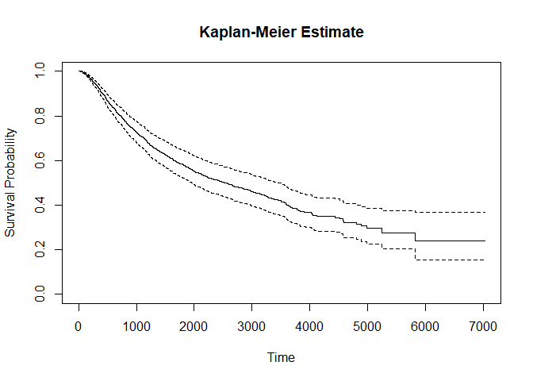

K-M estimation part
================
Zhezheng Jin
2023-11-28

## discription in two treatment

``` r
head(rotterdam)
```

    ##      pid year age meno  size grade nodes pgr  er hormon chemo rtime recur dtime
    ## 1393   1 1992  74    1  <=20     3     0  35 291      0     0  1799     0  1799
    ## 1416   2 1984  79    1 20-50     3     0  36 611      0     0  2828     0  2828
    ## 2962   3 1983  44    0  <=20     2     0 138   0      0     0  6012     0  6012
    ## 1455   4 1985  70    1 20-50     3     0   0  12      0     0  2624     0  2624
    ## 977    5 1983  75    1  <=20     3     0 260 409      0     0  4915     0  4915
    ## 617    6 1983  52    0  <=20     3     0 139 303      0     0  5888     0  5888
    ##      death
    ## 1393     0
    ## 1416     0
    ## 2962     0
    ## 1455     0
    ## 977      0
    ## 617      0

``` r
Rotterdam=data.frame(rotterdam)
summary(Rotterdam)
```

    ##       pid              year           age             meno         size     
    ##  Min.   :   1.0   Min.   :1978   Min.   :24.00   Min.   :0.00   <=20 :1387  
    ##  1st Qu.: 753.2   1st Qu.:1986   1st Qu.:45.00   1st Qu.:0.00   20-50:1291  
    ##  Median :1504.5   Median :1988   Median :54.00   Median :1.00   >50  : 304  
    ##  Mean   :1505.0   Mean   :1988   Mean   :55.06   Mean   :0.56               
    ##  3rd Qu.:2254.8   3rd Qu.:1990   3rd Qu.:65.00   3rd Qu.:1.00               
    ##  Max.   :3007.0   Max.   :1993   Max.   :90.00   Max.   :1.00               
    ##      grade           nodes             pgr               er        
    ##  Min.   :2.000   Min.   : 0.000   Min.   :   0.0   Min.   :   0.0  
    ##  1st Qu.:2.000   1st Qu.: 0.000   1st Qu.:   4.0   1st Qu.:  11.0  
    ##  Median :3.000   Median : 1.000   Median :  41.0   Median :  61.0  
    ##  Mean   :2.734   Mean   : 2.712   Mean   : 161.8   Mean   : 166.6  
    ##  3rd Qu.:3.000   3rd Qu.: 4.000   3rd Qu.: 198.0   3rd Qu.: 202.8  
    ##  Max.   :3.000   Max.   :34.000   Max.   :5004.0   Max.   :3275.0  
    ##      hormon           chemo            rtime            recur       
    ##  Min.   :0.0000   Min.   :0.0000   Min.   :  36.0   Min.   :0.0000  
    ##  1st Qu.:0.0000   1st Qu.:0.0000   1st Qu.: 823.5   1st Qu.:0.0000  
    ##  Median :0.0000   Median :0.0000   Median :1940.0   Median :1.0000  
    ##  Mean   :0.1137   Mean   :0.1945   Mean   :2097.9   Mean   :0.5091  
    ##  3rd Qu.:0.0000   3rd Qu.:0.0000   3rd Qu.:3198.8   3rd Qu.:1.0000  
    ##  Max.   :1.0000   Max.   :1.0000   Max.   :7043.0   Max.   :1.0000  
    ##      dtime          death       
    ##  Min.   :  36   Min.   :0.0000  
    ##  1st Qu.:1607   1st Qu.:0.0000  
    ##  Median :2638   Median :0.0000  
    ##  Mean   :2605   Mean   :0.4266  
    ##  3rd Qu.:3555   3rd Qu.:1.0000  
    ##  Max.   :7043   Max.   :1.0000

``` r
str(Rotterdam)
```

    ## 'data.frame':    2982 obs. of  15 variables:
    ##  $ pid   : int  1 2 3 4 5 6 7 8 9 10 ...
    ##  $ year  : int  1992 1984 1983 1985 1983 1983 1993 1988 1988 1988 ...
    ##  $ age   : int  74 79 44 70 75 52 40 53 60 52 ...
    ##  $ meno  : int  1 1 0 1 1 0 0 1 1 0 ...
    ##  $ size  : Factor w/ 3 levels "<=20","20-50",..: 1 2 1 2 1 1 1 1 1 2 ...
    ##  $ grade : int  3 3 2 3 3 3 2 2 2 3 ...
    ##  $ nodes : int  0 0 0 0 0 0 0 0 0 5 ...
    ##  $ pgr   : int  35 36 138 0 260 139 13 1 627 316 ...
    ##  $ er    : int  291 611 0 12 409 303 4 4 151 976 ...
    ##  $ hormon: int  0 0 0 0 0 0 0 0 0 0 ...
    ##  $ chemo : int  0 0 0 0 0 0 0 0 0 0 ...
    ##  $ rtime : num  1799 2828 6012 2624 4915 ...
    ##  $ recur : int  0 0 0 0 0 0 0 0 0 0 ...
    ##  $ dtime : num  1799 2828 6012 2624 4915 ...
    ##  $ death : int  0 0 0 0 0 0 0 0 0 0 ...

``` r
description_table <- data.frame(
  Characteristic = c("age24-45", "age46-65", "meno=1", 
                     "size<=20", "size20-50", "grade=2", 
                     "nodes<4", "pgr<200", "er<200", "chemo=1"),
  Overall = c(
    sum(Rotterdam$age >= 24 & Rotterdam$age <= 45),
    sum(Rotterdam$age > 45 & Rotterdam$age <= 65),
    sum(Rotterdam$meno == 1),
    sum(Rotterdam$size=="<=20"),
    sum(Rotterdam$size =="20-50"),
    sum(Rotterdam$grade == 2),
    sum(Rotterdam$nodes < 4),
    sum(Rotterdam$pgr < 200),
    sum(Rotterdam$er < 200),
    sum(Rotterdam$chemo == 1)
  ),
  Treat0 = c(
    sum(Rotterdam$age >= 24 & Rotterdam$age <= 45 & Rotterdam$hormon == 0),
    sum(Rotterdam$age > 45 & Rotterdam$age <= 65 & Rotterdam$hormon == 0),
    sum(Rotterdam$meno == 1 & Rotterdam$hormon == 0),
    sum(Rotterdam$size=="<=20" & Rotterdam$hormon == 0),
    sum(Rotterdam$size =="20-50" & Rotterdam$hormon == 0),
    sum(Rotterdam$grade == 2 & Rotterdam$hormon == 0),
    sum(Rotterdam$nodes < 4 & Rotterdam$hormon == 0),
    sum(Rotterdam$pgr < 200 & Rotterdam$hormon == 0),
    sum(Rotterdam$er < 200 & Rotterdam$hormon == 0),
    sum(Rotterdam$chemo == 1 & Rotterdam$hormon == 0)
  ),
  Treat1 = c(
    sum(Rotterdam$age >= 24 & Rotterdam$age <= 45 & Rotterdam$hormon == 1),
    sum(Rotterdam$age > 45 & Rotterdam$age <= 65 & Rotterdam$hormon == 1),
    sum(Rotterdam$meno == 1 & Rotterdam$hormon == 1),
    sum(Rotterdam$size=="<=20" & Rotterdam$hormon == 1),
    sum(Rotterdam$size =="20-50"& Rotterdam$hormon == 1),
    sum(Rotterdam$grade == 2 & Rotterdam$hormon == 1),
    sum(Rotterdam$nodes < 4 & Rotterdam$hormon == 1),
    sum(Rotterdam$pgr < 200 & Rotterdam$hormon == 1),
    sum(Rotterdam$er < 200 & Rotterdam$hormon == 1),
    sum(Rotterdam$chemo == 1 & Rotterdam$hormon == 1)
  )
)

print(description_table)
```

    ##    Characteristic Overall Treat0 Treat1
    ## 1        age24-45     783    769     14
    ## 2        age46-65    1472   1277    195
    ## 3          meno=1    1670   1372    298
    ## 4        size<=20    1387   1283    104
    ## 5       size20-50    1291   1119    172
    ## 6         grade=2     794    735     59
    ## 7         nodes<4    2200   2061    139
    ## 8         pgr<200    2240   1956    284
    ## 9          er<200    2229   1987    242
    ## 10        chemo=1     580    552     28

## summary of variables

``` r
char_table <- data.frame(
  Characteristic = c("year", "age", "meno", "grade", "nodes", "pgr", "er", "hormon", "chemo", "rtime", "recur", "dtime", "death"),
  Mean = NA,
  Median = NA,
  Min = NA,
  Max = NA,
  Sd = NA
)


for (i in 1:nrow(char_table)) {
  var_name <- char_table$Characteristic[i]
  char_table$Mean[i] <- mean(Rotterdam[[var_name]], na.rm = TRUE)
  char_table$Median[i] <- median(Rotterdam[[var_name]], na.rm = TRUE)
  char_table$Min[i] <- min(Rotterdam[[var_name]], na.rm = TRUE)
  char_table$Max[i] <- max(Rotterdam[[var_name]], na.rm = TRUE)
  char_table$Sd[i] <- sd(Rotterdam[[var_name]], na.rm = TRUE)
}

char_table
```

    ##    Characteristic         Mean Median  Min  Max           Sd
    ## 1            year 1988.1613011 1988.0 1978 1993    3.0354837
    ## 2             age   55.0583501   54.0   24   90   12.9529876
    ## 3            meno    0.5600268    1.0    0    1    0.4964670
    ## 4           grade    2.7337357    3.0    2    3    0.4420782
    ## 5           nodes    2.7122736    1.0    0   34    4.3838444
    ## 6             pgr  161.8313213   41.0    0 5004  291.3110759
    ## 7              er  166.5895372   61.0    0 3275  272.4654859
    ## 8          hormon    0.1136821    0.0    0    1    0.3174780
    ## 9           chemo    0.1945003    0.0    0    1    0.3958819
    ## 10          rtime 2097.9037559 1940.0   36 7043 1397.7118911
    ## 11          recur    0.5090543    1.0    0    1    0.5000019
    ## 12          dtime 2605.3400402 2638.5   36 7043 1298.0775535
    ## 13          death    0.4265594    0.0    0    1    0.4946600

## KM estimation

``` r
status  <- pmax(rotterdam$recur, rotterdam$death)
rfstime <- with(rotterdam, ifelse(recur==1, rtime, dtime))
fit1 <- coxph(Surv(rfstime, status) ~ pspline(age) + meno + size + 
        pspline(nodes) + er,
     data=rotterdam, subset = (nodes > 0))
summary(fit1)
```

    ## Call:
    ## coxph(formula = Surv(rfstime, status) ~ pspline(age) + meno + 
    ##     size + pspline(nodes) + er, data = rotterdam, subset = (nodes > 
    ##     0))
    ## 
    ##   n= 1546, number of events= 1080 
    ## 
    ##                        coef       se(coef)  se2      Chisq  DF   p      
    ## pspline(age), linear    0.0013046 0.0038282 0.003826   0.12 1.00 7.3e-01
    ## pspline(age), nonlin                                  16.58 3.08 9.4e-04
    ## meno                    0.3439648 0.1298336 0.124581   7.02 1.00 8.1e-03
    ## size20-50               0.2429536 0.0738585 0.073764  10.82 1.00 1.0e-03
    ## size>50                 0.5061899 0.0954152 0.095209  28.14 1.00 1.1e-07
    ## pspline(nodes), linear  0.0622802 0.0061756 0.006153 101.71 1.00 6.4e-24
    ## pspline(nodes), nonlin                                51.94 3.05 3.4e-11
    ## er                     -0.0002761 0.0001232 0.000123   5.02 1.00 2.5e-02
    ## 
    ##             exp(coef) exp(-coef) lower .95 upper .95
    ## ps(age)3       1.0423     0.9594    0.5715     1.901
    ## ps(age)4       1.0884     0.9188    0.4189     2.828
    ## ps(age)5       1.0374     0.9640    0.3550     3.031
    ## ps(age)6       0.8442     1.1845    0.2916     2.444
    ## ps(age)7       0.7276     1.3744    0.2553     2.074
    ## ps(age)8       0.7316     1.3669    0.2529     2.117
    ## ps(age)9       0.7231     1.3829    0.2470     2.117
    ## ps(age)10      0.7310     1.3679    0.2497     2.140
    ## ps(age)11      0.8835     1.1318    0.3012     2.592
    ## ps(age)12      1.1358     0.8804    0.3784     3.409
    ## ps(age)13      1.4546     0.6875    0.4307     4.913
    ## ps(age)14      1.8713     0.5344    0.4082     8.580
    ## meno           1.4105     0.7090    1.0936     1.819
    ## size20-50      1.2750     0.7843    1.1032     1.474
    ## size>50        1.6590     0.6028    1.3760     2.000
    ## ps(nodes)3     1.9870     0.5033    1.1567     3.413
    ## ps(nodes)4     3.7615     0.2659    1.9044     7.430
    ## ps(nodes)5     5.6603     0.1767    2.9794    10.753
    ## ps(nodes)6     7.1670     0.1395    3.8063    13.495
    ## ps(nodes)7     7.4269     0.1346    3.8942    14.165
    ## ps(nodes)8     7.0286     0.1423    3.5928    13.750
    ## ps(nodes)9     6.3944     0.1564    3.1704    12.897
    ## ps(nodes)10    5.9968     0.1668    2.8612    12.569
    ## ps(nodes)11    6.2184     0.1608    2.7429    14.097
    ## ps(nodes)12    6.9446     0.1440    2.6851    17.962
    ## ps(nodes)13    8.2802     0.1208    2.4257    28.266
    ## ps(nodes)14    9.9986     0.1000    1.7687    56.525
    ## er             0.9997     1.0003    0.9995     1.000
    ## 
    ## Iterations: 6 outer, 17 Newton-Raphson
    ##      Theta= 0.9576637 
    ##      Theta= 0.9391805 
    ## Degrees of freedom for terms= 4.1 0.9 2.0 4.1 1.0 
    ## Concordance= 0.667  (se = 0.009 )
    ## Likelihood ratio test= 291.9  on 12.04 df,   p=<2e-16

``` r
fit1_surv <- survfit(fit1)

# 绘制Kaplan-Meier估计图
plot(fit1_surv, main = "Kaplan-Meier Estimate", xlab = "Time", ylab = "Survival Probability")
```

<!-- -->

The total number of subjects observed was 1546, among which 1080
experienced the event of interest We can see from the Chisq and p-values
here suggest that the non-linear relationships of these variables are
significant.
