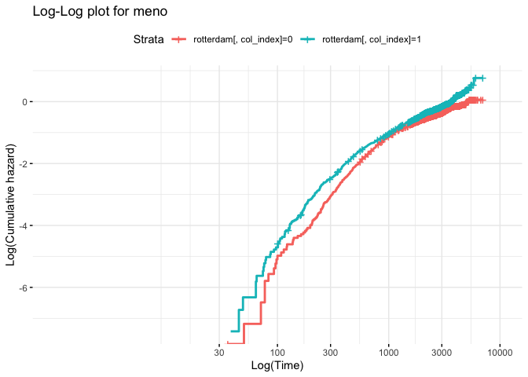
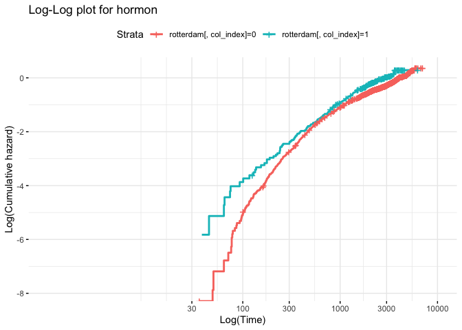

mc5296
================
2023-11-28

``` r
library(survival)
library(MASS)
library(ggplot2)
library(tidyverse)
```

    ## ── Attaching core tidyverse packages ──────────────────────── tidyverse 2.0.0 ──
    ## ✔ dplyr     1.1.3     ✔ readr     2.1.4
    ## ✔ forcats   1.0.0     ✔ stringr   1.5.0
    ## ✔ lubridate 1.9.2     ✔ tibble    3.2.1
    ## ✔ purrr     1.0.2     ✔ tidyr     1.3.0
    ## ── Conflicts ────────────────────────────────────────── tidyverse_conflicts() ──
    ## ✖ dplyr::filter() masks stats::filter()
    ## ✖ dplyr::lag()    masks stats::lag()
    ## ✖ dplyr::select() masks MASS::select()
    ## ℹ Use the conflicted package (<http://conflicted.r-lib.org/>) to force all conflicts to become errors

``` r
library(survminer)
```

    ## Loading required package: ggpubr
    ## 
    ## Attaching package: 'survminer'
    ## 
    ## The following object is masked from 'package:survival':
    ## 
    ##     myeloma

``` r
rotterdam[1:100,]
```

    ##      pid year age meno  size grade nodes  pgr   er hormon chemo rtime recur
    ## 1393   1 1992  74    1  <=20     3     0   35  291      0     0  1799     0
    ## 1416   2 1984  79    1 20-50     3     0   36  611      0     0  2828     0
    ## 2962   3 1983  44    0  <=20     2     0  138    0      0     0  6012     0
    ## 1455   4 1985  70    1 20-50     3     0    0   12      0     0  2624     0
    ## 977    5 1983  75    1  <=20     3     0  260  409      0     0  4915     0
    ## 617    6 1983  52    0  <=20     3     0  139  303      0     0  5888     0
    ## 51     7 1993  40    0  <=20     2     0   13    4      0     0  2491     0
    ## 473    8 1988  53    1  <=20     2     0    1    4      0     0  4150     0
    ## 362    9 1988  60    1  <=20     2     0  627  151      0     0  3919     0
    ## 2182  10 1988  52    0 20-50     3     5  316  976      0     0  3647     0
    ## 1123  11 1989  66    1 20-50     3     0    0  283      0     0  2133     0
    ## 375   12 1988  42    0  <=20     2     1  245   67      0     1  4146     0
    ## 1303  13 1992  74    1 20-50     3     0  317  136      0     0  2124     0
    ## 2565  14 1993  55    0   >50     3     9    0   21      1     0  1773     0
    ## 1039  15 1989  57    1  <=20     3     0    0    0      0     0  2682     0
    ## 917   16 1993  49    0  <=20     3     0  286   56      0     0  2591     0
    ## 2079  17 1993  61    1 20-50     3     4    0  604      1     0  2734     0
    ## 2246  18 1990  52    1 20-50     3     6    6    3      0     0  2379     0
    ## 1822  19 1979  51    0 20-50     3     1   14    0      0     0  7027     0
    ## 800   20 1993  62    1  <=20     3     0   22   84      0     0  2498     0
    ## 1684  21 1993  57    1  <=20     3     1    4  271      1     0   851     0
    ## 171   22 1990  47    0  <=20     2     0  142  189      0     0  3716     0
    ## 580   23 1992  61    1  <=20     3     0  354  105      0     0  2584     0
    ## 15    24 1987  52    1  <=20     3     0  649  190      0     0  4665     0
    ## 244   25 1993  52    1  <=20     3     0  147   91      0     0  2835     0
    ## 1913  26 1986  63    1  <=20     3     2   24   30      0     0  3482     0
    ## 1147  27 1990  61    1  <=20     3     0    0    0      0     0  3339     0
    ## 62    28 1988  60    1  <=20     2     0  556  303      0     0  4090     0
    ## 143   29 1993  32    0 20-50     2     1  665   94      0     1  2880     0
    ## 252   30 1988  38    0  <=20     2     0  305   70      0     0  3997     0
    ## 471   31 1985  45    0 20-50     2     0  114   44      0     0  5309     0
    ## 1694  32 1988  56    0 20-50     3     1   14  279      0     1  2872     0
    ## 1099  33 1993  63    1   >50     3     0  414   70      0     0  1025     0
    ## 435   34 1989  44    0 20-50     3     0  163  142      0     0  3934     0
    ## 1866  35 1988  53    0 20-50     3     2   19   93      0     1  3829     0
    ## 1277  36 1990  54    1  <=20     3     1    7    4      0     1  2579     0
    ## 929   37 1988  73    1  <=20     3     0 1776 1553      0     0  2603     0
    ## 785   38 1982  45    0 20-50     3     0   55    0      0     0  5775     0
    ## 799   39 1988  66    1  <=20     3     0  115  108      0     0  3319     0
    ## 2286  40 1989  70    1 20-50     3     4  391  253      0     0  1534     0
    ## 2173  41 1988  81    1 20-50     3     1    6  152      0     0  1368     0
    ## 527   42 1988  61    1  <=20     3     0   11  157      0     0  4072     0
    ## 99    43 1993  37    0  <=20     2     0    4    0      0     0  2639     0
    ## 1399  44 1991  78    1  <=20     3     0  101  360      0     0  2541     0
    ## 2406  45 1983  72    1 20-50     3     5   15   18      0     0  3956     0
    ## 202   46 1993  47    0 20-50     3     0  605  169      0     0  2668     0
    ## 123   47 1989  47    0  <=20     2     0  957  197      0     0  3803     0
    ## 1812  48 1991  59    1 20-50     3     2   69   73      1     0  2209     0
    ## 687   49 1993  64    1  <=20     2     0  541  541      0     0  2050     0
    ## 1165  50 1983  68    1 20-50     3     0    0    7      0     0  5068     0
    ## 238   51 1989  55    1 20-50     2     0  101  273      0     0  3709     0
    ## 1221  52 1992  29    0 20-50     3     4    4   10      0     1  3008     0
    ## 910   53 1987  74    1  <=20     3     0 1303  687      0     0  3779     0
    ## 1329  54 1993  49    0  <=20     2     1  453  574      0     1  2879     0
    ## 424   55 1991  55    0  <=20     3     0  121  407      0     0  2924     0
    ## 888   56 1989  50    0 20-50     3     1  465   58      0     1  2926     0
    ## 93    57 1991  56    1  <=20     2     0   47   60      0     0  3248     0
    ## 2463  58 1992  69    1 20-50     2     8    5    6      1     0  1869     0
    ## 474   59 1988  61    1  <=20     3     0    7  600      0     0  3746     0
    ## 1327  60 1991  47    0  <=20     3     0    0    0      0     0  2753     0
    ## 79    61 1991  35    0  <=20     2     0  153   80      0     0  1841     0
    ## 964   62 1989  42    0 20-50     3     0    0    0      0     0  4039     0
    ## 316   63 1989  59    1   >50     3     0  581  197      0     0  3811     0
    ## 1076  64 1991  40    0 20-50     2     0    0    0      0     0  2415     0
    ## 1314  65 1992  71    1 20-50     3     0   13  171      0     0  1869     0
    ## 340   66 1988  60    1  <=20     3     0   59  636      0     0  4084     0
    ## 2057  67 1984  47    0 20-50     3     4    4    5      0     1  5164     0
    ## 387   68 1991  55    1  <=20     3     0  241   53      0     0  2533     0
    ## 1058  69 1988  68    1  <=20     3     0    1  766      0     0  2548     0
    ## 1075  70 1990  42    0 20-50     3     1  230   66      0     1  3492     0
    ## 1889  71 1983  67    1 20-50     3     2  244  121      0     0  3804     0
    ## 2083  72 1992  44    0   >50     2     7   14   46      0     1  1813     0
    ## 2123  73 1986  62    1 20-50     3     5   18  528      0     0  3627     0
    ## 444   74 1988  41    0  <=20     3     0   28   68      0     0  3671     0
    ## 546   75 1988  44    0 20-50     2     0    8    4      0     0  1623     0
    ## 764   76 1989  46    0  <=20     3     0   62   14      0     0  3866     0
    ## 348   77 1985  66    1  <=20     2     0  247   77      0     0  4320     0
    ## 1579  78 1984  76    1 20-50     3     0    0  117      0     0  2435     0
    ## 1700  79 1986  60    1  <=20     2     2   41  166      1     0  3978     0
    ## 179   80 1991  38    0  <=20     3     0  151   13      0     0  1818     0
    ## 257   81 1993  61    1  <=20     3     0   28   21      0     0  2916     0
    ## 1718  82 1990  73    1 20-50     3     0    0    0      0     0  2205     0
    ## 1313  83 1984  70    1 20-50     3     0   70    0      0     0  3930     0
    ## 631   84 1988  44    0 20-50     2     0  168    9      0     0  4000     0
    ## 2006  85 1993  78    1  <=20     3     1  142  162      1     0  1694     0
    ## 625   86 1988  44    0  <=20     3     0   93   26      0     0  3540     0
    ## 1797  87 1991  29    0 20-50     3     4    0    1      0     1  2995     0
    ## 207   88 1985  35    0  <=20     3     0   70   30      0     0  4831     0
    ## 144   89 1987  46    0  <=20     2     0   93  325      0     0  3489     0
    ## 830   90 1988  44    0  <=20     3     0    7   13      0     0  3283     0
    ## 177   91 1993  41    0  <=20     2     0   84   22      0     0  2612     0
    ## 121   92 1988  28    0  <=20     2     1  251   11      0     1  3337     0
    ## 215   93 1989  30    0  <=20     3     0    1   25      0     0  3702     0
    ## 1252  94 1985  62    1 20-50     2     2  278   89      0     0  5193     0
    ## 338   95 1988  55    1  <=20     3     0    8  117      0     0  3752     0
    ## 1289  96 1990  51    0 20-50     3     1  227  875      0     1  3471     0
    ## 331   97 1989  55    1  <=20     2     0  170   37      0     0  3514     0
    ## 2444  98 1993  72    1  <=20     2     8    4  112      1     0  1752     0
    ## 2020  99 1988  58    1  <=20     3     4   29   41      1     0  3038     0
    ## 1457 100 1981  44    0  <=20     3     2    0    0      0     1  5591     0
    ##      dtime death
    ## 1393  1799     0
    ## 1416  2828     0
    ## 2962  6012     0
    ## 1455  2624     0
    ## 977   4915     0
    ## 617   5888     0
    ## 51    2491     0
    ## 473   4150     0
    ## 362   3919     0
    ## 2182  3647     0
    ## 1123  2133     0
    ## 375   4146     0
    ## 1303  2124     0
    ## 2565  1773     0
    ## 1039  2682     0
    ## 917   2591     0
    ## 2079  2734     0
    ## 2246  2379     0
    ## 1822  7027     0
    ## 800   2498     0
    ## 1684   851     0
    ## 171   3716     0
    ## 580   2584     0
    ## 15    4665     0
    ## 244   2835     0
    ## 1913  3482     0
    ## 1147  3339     0
    ## 62    4090     0
    ## 143   2880     0
    ## 252   3997     0
    ## 471   5309     0
    ## 1694  2872     0
    ## 1099  1025     0
    ## 435   3934     0
    ## 1866  3829     0
    ## 1277  2579     0
    ## 929   2603     0
    ## 785   5775     0
    ## 799   3319     0
    ## 2286  2416     1
    ## 2173  2225     1
    ## 527   4072     0
    ## 99    2639     0
    ## 1399  2541     0
    ## 2406  3956     0
    ## 202   2668     0
    ## 123   3803     0
    ## 1812  2209     0
    ## 687   2050     0
    ## 1165  5068     0
    ## 238   3709     0
    ## 1221  3008     0
    ## 910   3779     0
    ## 1329  2879     0
    ## 424   2924     0
    ## 888   2926     0
    ## 93    3248     0
    ## 2463  1869     0
    ## 474   3746     0
    ## 1327  2753     0
    ## 79    1841     0
    ## 964   4039     0
    ## 316   3811     0
    ## 1076  2415     0
    ## 1314  1869     0
    ## 340   4084     0
    ## 2057  5164     0
    ## 387   2533     0
    ## 1058  2798     1
    ## 1075  3492     0
    ## 1889  3804     0
    ## 2083  1813     0
    ## 2123  3627     0
    ## 444   3671     0
    ## 546   1623     0
    ## 764   3866     0
    ## 348   4320     0
    ## 1579  3980     1
    ## 1700  3978     0
    ## 179   1818     0
    ## 257   2916     0
    ## 1718  2205     0
    ## 1313  3930     0
    ## 631   4000     0
    ## 2006  1694     0
    ## 625   3540     0
    ## 1797  2995     0
    ## 207   4831     0
    ## 144   3489     0
    ## 830   3283     0
    ## 177   2612     0
    ## 121   3337     0
    ## 215   3702     0
    ## 1252  5193     0
    ## 338   3752     0
    ## 1289  3471     0
    ## 331   3514     0
    ## 2444  1752     0
    ## 2020  3038     0
    ## 1457  5591     0

``` r
rfs  <- pmax(rotterdam$recur, rotterdam$death)
rfstime <- with(rotterdam, ifelse(recur==1, rtime, dtime))
rotterdam$tstart = c(rep(0,2982))
surv_object <- with(rotterdam, Surv(tstart, rfstime, rfs)) #with consideration of time-varying covariates
```

``` r
# Set up the plotting area to have 2 rows and 2 columns
par(mfrow = c(3, 3))

# Fit a basic Cox proportional hazards model
cox_model <- coxph(Surv(rfstime, rfs) ~ age + meno + size + grade + nodes + pgr + er + hormon + chemo, data = rotterdam)
summary(cox_model)
```

    ## Call:
    ## coxph(formula = Surv(rfstime, rfs) ~ age + meno + size + grade + 
    ##     nodes + pgr + er + hormon + chemo, data = rotterdam)
    ## 
    ##   n= 2982, number of events= 1713 
    ## 
    ##                 coef  exp(coef)   se(coef)      z Pr(>|z|)    
    ## age        3.209e-03  1.003e+00  3.283e-03  0.978   0.3283    
    ## meno       4.724e-02  1.048e+00  8.534e-02  0.554   0.5799    
    ## size20-50  3.582e-01  1.431e+00  5.469e-02  6.550 5.75e-11 ***
    ## size>50    6.483e-01  1.912e+00  8.229e-02  7.878 3.33e-15 ***
    ## grade      3.236e-01  1.382e+00  6.030e-02  5.366 8.05e-08 ***
    ## nodes      7.416e-02  1.077e+00  4.428e-03 16.748  < 2e-16 ***
    ## pgr       -1.044e-04  9.999e-01  9.695e-05 -1.076   0.2817    
    ## er        -1.611e-05  1.000e+00  9.300e-05 -0.173   0.8625    
    ## hormon    -1.319e-01  8.765e-01  7.763e-02 -1.699   0.0894 .  
    ## chemo     -8.705e-02  9.166e-01  6.971e-02 -1.249   0.2117    
    ## ---
    ## Signif. codes:  0 '***' 0.001 '**' 0.01 '*' 0.05 '.' 0.1 ' ' 1
    ## 
    ##           exp(coef) exp(-coef) lower .95 upper .95
    ## age          1.0032     0.9968    0.9968     1.010
    ## meno         1.0484     0.9539    0.8869     1.239
    ## size20-50    1.4308     0.6989    1.2854     1.593
    ## size>50      1.9123     0.5229    1.6275     2.247
    ## grade        1.3821     0.7235    1.2280     1.555
    ## nodes        1.0770     0.9285    1.0677     1.086
    ## pgr          0.9999     1.0001    0.9997     1.000
    ## er           1.0000     1.0000    0.9998     1.000
    ## hormon       0.8765     1.1410    0.7527     1.020
    ## chemo        0.9166     1.0910    0.7996     1.051
    ## 
    ## Concordance= 0.668  (se = 0.007 )
    ## Likelihood ratio test= 490.5  on 10 df,   p=<2e-16
    ## Wald test            = 614.4  on 10 df,   p=<2e-16
    ## Score (logrank) test = 678.3  on 10 df,   p=<2e-16

``` r
# Checking the Proportional Hazards assumption
cox.zph_model <- cox.zph(cox_model)

# Extract the names of the covariates to use as plot titles
covariate_names <- names(rotterdam[3:11])

# Plot Schoenfeld residuals for each covariate with a title
for(i in 1:9){
  plot(cox.zph_model, var = i)
  title(main = paste("Schoenfeld Residuals for", covariate_names[i]))
}
```

<!-- -->

``` r
ggsave(file = "cox_ph_files/Schoenfeld.jpg")
```

    ## Saving 7 x 5 in image

``` r
categorical_vars <- c(4, 5, 6, 10, 11)
categorical_names <- c("meno", "size", "grade", "hormon", "chemo")

# Ensure 'rotterdam' is your data frame and 'surv_object' is correctly defined before this loop

for (i in 1:5) {
  col_index <- categorical_vars[i]
  # Fit Kaplan-Meier estimator
  fit <- survfit(surv_object ~ rotterdam[,col_index], data = rotterdam)
  
  # Plot using ggsurvplot
  p <- ggsurvplot(
    fit, 
    data = rotterdam, 
    fun = "cloglog",        # For complementary log-log survival function
    ggtheme = theme_minimal(),
    title = paste("Log-Log plot for", categorical_names[i]),
    xlab = "Log(Time)",
    ylab = "Log(Cumulative hazard)"
  )
  
  # Print the plot
  print(p$plot)
}
```

<!-- --><!-- --><!-- --><!-- --><!-- -->

``` r
fit1 <- coxph(surv_object ~ age + size + grade + nodes + pgr + er + hormon + chemo, data = rotterdam)
summary(fit1)
```

    ## Call:
    ## coxph(formula = surv_object ~ age + size + grade + nodes + pgr + 
    ##     er + hormon + chemo, data = rotterdam)
    ## 
    ##   n= 2982, number of events= 1713 
    ## 
    ##                 coef  exp(coef)   se(coef)      z Pr(>|z|)    
    ## age        4.528e-03  1.005e+00  2.256e-03  2.007   0.0447 *  
    ## size20-50  3.567e-01  1.429e+00  5.462e-02  6.531 6.53e-11 ***
    ## size>50    6.439e-01  1.904e+00  8.194e-02  7.859 3.87e-15 ***
    ## grade      3.254e-01  1.385e+00  6.022e-02  5.403 6.55e-08 ***
    ## nodes      7.442e-02  1.077e+00  4.403e-03 16.901  < 2e-16 ***
    ## pgr       -1.109e-04  9.999e-01  9.639e-05 -1.151   0.2498    
    ## er        -9.878e-06  1.000e+00  9.224e-05 -0.107   0.9147    
    ## hormon    -1.280e-01  8.798e-01  7.733e-02 -1.655   0.0978 .  
    ## chemo     -9.335e-02  9.109e-01  6.876e-02 -1.358   0.1746    
    ## ---
    ## Signif. codes:  0 '***' 0.001 '**' 0.01 '*' 0.05 '.' 0.1 ' ' 1
    ## 
    ##           exp(coef) exp(-coef) lower .95 upper .95
    ## age          1.0045     0.9955    1.0001     1.009
    ## size20-50    1.4287     0.7000    1.2836     1.590
    ## size>50      1.9040     0.5252    1.6215     2.236
    ## grade        1.3845     0.7223    1.2304     1.558
    ## nodes        1.0773     0.9283    1.0680     1.087
    ## pgr          0.9999     1.0001    0.9997     1.000
    ## er           1.0000     1.0000    0.9998     1.000
    ## hormon       0.8798     1.1366    0.7561     1.024
    ## chemo        0.9109     1.0978    0.7960     1.042
    ## 
    ## Concordance= 0.668  (se = 0.007 )
    ## Likelihood ratio test= 490.1  on 9 df,   p=<2e-16
    ## Wald test            = 614.3  on 9 df,   p=<2e-16
    ## Score (logrank) test = 678.1  on 9 df,   p=<2e-16

``` r
stepwise_model <- stepAIC(fit1, direction = "both", trace = FALSE)
summary(stepwise_model)
```

    ## Call:
    ## coxph(formula = surv_object ~ age + size + grade + nodes + hormon + 
    ##     chemo, data = rotterdam)
    ## 
    ##   n= 2982, number of events= 1713 
    ## 
    ##                coef exp(coef)  se(coef)      z Pr(>|z|)    
    ## age        0.004264  1.004273  0.002169  1.966   0.0493 *  
    ## size20-50  0.360120  1.433502  0.054553  6.601 4.08e-11 ***
    ## size>50    0.646274  1.908416  0.081949  7.886 3.11e-15 ***
    ## grade      0.335949  1.399267  0.059633  5.634 1.77e-08 ***
    ## nodes      0.074610  1.077464  0.004396 16.974  < 2e-16 ***
    ## hormon    -0.123227  0.884063  0.077213 -1.596   0.1105    
    ## chemo     -0.098512  0.906185  0.068519 -1.438   0.1505    
    ## ---
    ## Signif. codes:  0 '***' 0.001 '**' 0.01 '*' 0.05 '.' 0.1 ' ' 1
    ## 
    ##           exp(coef) exp(-coef) lower .95 upper .95
    ## age          1.0043     0.9957    1.0000     1.009
    ## size20-50    1.4335     0.6976    1.2881     1.595
    ## size>50      1.9084     0.5240    1.6252     2.241
    ## grade        1.3993     0.7147    1.2449     1.573
    ## nodes        1.0775     0.9281    1.0682     1.087
    ## hormon       0.8841     1.1311    0.7599     1.029
    ## chemo        0.9062     1.1035    0.7923     1.036
    ## 
    ## Concordance= 0.667  (se = 0.007 )
    ## Likelihood ratio test= 488.6  on 7 df,   p=<2e-16
    ## Wald test            = 614.2  on 7 df,   p=<2e-16
    ## Score (logrank) test = 677.5  on 7 df,   p=<2e-16

## Cox Proportional Hazard Ratio Model:

#### Proportional Hazard Checking:

An initial Cox model was constructed including all mentioned covariates.
The proportional hazards (PH) assumption, a critical assumption of the
Cox model, was evaluated using Schoenfeld residuals. The plots for each
covariate were examined (shown in figure ), and no clear trend over time
was observed except for hormon, suggesting that the PH assumption was
reasonably met for all other variables. Therefore we only consider
adjusting for hormon.

#### Model fitting:

The final model was selected using the stepwise AIC method with both
forward and backward selection strategies. The stepwise selection
process iteratively added or removed variables based on their impact on
the Akaike Information Criterion (AIC).

#### Model interpretation:

Variable Coefficients and Interpretation:

Age: The coefficient for the linear term of age is positive (coef =
0.004963) and statistically significant (p = 5.6e-03), suggesting that
the hazard increases with age. The non-linear component of age is also
significant (p = 7.0e-08), indicating that the relationship between age
and the hazard is not strictly linear.

Tumor Size: size20-50: Patients with medium-sized tumors (20-50) have a
hazard ratio of 1.3913 compared to those with the smallest tumors
(\<=20), indicating a 39.13% increase in the hazard, which is
statistically significant (p = 1.4e-09).

size\>50: Patients with large tumors (\>50) have a hazard ratio of
1.7721 compared to those with the smallest tumors, indicating a 77.21%
increase in the hazard, which is also statistically significant (p =
4.0e-12).

Grade: Each unit increase in differentiation grade is associated with a
39.17% increase in hazard (hazard ratio = 1.3917, p = 2.9e-08),
indicating that higher grades are associated with poorer prognosis.

Nodes: Each additional positive lymph node is associated with a 7.73%
increase in hazard (hazard ratio = 1.0773, p = 2.2e-65), which is highly
significant.

Model Fit:

The chi-square statistics for the individual covariates are all highly
significant, suggesting that the covariates are strong predictors of the
outcome.

The exp(coef) column provides the hazard ratios for each covariate,
which are used to interpret the effect size of each covariate on
survival.

In summary, the model indicates that age, tumor size, differentiation
grade, and the number of positive lymph nodes are all significant
predictors of survival. The effect of age on survival is non-linear,
with both a linear and non-linear relationship to the hazard. This model
provides valuable insights into the factors that are associated with
survival in the patient population from the Rotterdam dataset.
