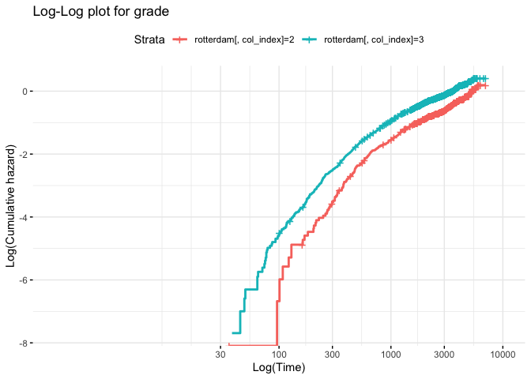

mc5296
================
2023-11-28

``` r
library(survival)
library(StepReg)
head(rotterdam)
```

    ##      pid year age meno  size grade nodes pgr  er hormon chemo rtime recur dtime
    ## 1393   1 1992  74    1  <=20     3     0  35 291      0     0  1799     0  1799
    ## 1416   2 1984  79    1 20-50     3     0  36 611      0     0  2828     0  2828
    ## 2962   3 1983  44    0  <=20     2     0 138   0      0     0  6012     0  6012
    ## 1455   4 1985  70    1 20-50     3     0   0  12      0     0  2624     0  2624
    ## 977    5 1983  75    1  <=20     3     0 260 409      0     0  4915     0  4915
    ## 617    6 1983  52    0  <=20     3     0 139 303      0     0  5888     0  5888
    ##      death
    ## 1393     0
    ## 1416     0
    ## 2962     0
    ## 1455     0
    ## 977      0
    ## 617      0

``` r
rfs  <- pmax(rotterdam$recur, rotterdam$death)
rfstime <- with(rotterdam, ifelse(recur==1, rtime, dtime))
rotterdam$tstart = c(rep(0,2982))
surv_object <- with(rotterdam, Surv(tstart, rfstime, rfs)) #with consideration of time-varying covariates
fit1 <- coxph(surv_object ~ pspline(age) + size + grade + nodes + pgr + er + hormon + chemo, data = rotterdam)
fit2 <- coxph(Surv(rfstime, rfs)~ pspline(age) + size + grade + nodes + pgr + er + hormon + chemo, data = rotterdam)
summary(fit1)
```

    ## Call:
    ## coxph(formula = surv_object ~ pspline(age) + size + grade + nodes + 
    ##     pgr + er + hormon + chemo, data = rotterdam)
    ## 
    ##   n= 2982, number of events= 1713 
    ## 
    ##                      coef       se(coef)  se2       Chisq  DF   p      
    ## pspline(age), linear  4.409e-03 2.118e-03 2.118e-03   4.33 1.00 3.7e-02
    ## pspline(age), nonlin                                 35.87 3.05 8.6e-08
    ## size20-50             3.337e-01 5.479e-02 5.478e-02  37.09 1.00 1.1e-09
    ## size>50               5.829e-01 8.278e-02 8.272e-02  49.59 1.00 1.9e-12
    ## grade                 3.216e-01 6.020e-02 6.018e-02  28.53 1.00 9.2e-08
    ## nodes                 7.620e-02 4.420e-03 4.417e-03 297.23 1.00 1.3e-66
    ## pgr                  -1.090e-04 9.704e-05 9.688e-05   1.26 1.00 2.6e-01
    ## er                   -2.711e-05 9.424e-05 9.400e-05   0.08 1.00 7.7e-01
    ## hormon               -1.077e-01 7.784e-02 7.775e-02   1.92 1.00 1.7e-01
    ## chemo                -9.963e-02 7.012e-02 6.988e-02   2.02 1.00 1.6e-01
    ## 
    ##           exp(coef) exp(-coef) lower .95 upper .95
    ## ps(age)3     0.9295     1.0759    0.5901     1.464
    ## ps(age)4     0.8642     1.1571    0.4200     1.778
    ## ps(age)5     0.7667     1.3043    0.3412     1.723
    ## ps(age)6     0.6359     1.5725    0.2851     1.419
    ## ps(age)7     0.5794     1.7258    0.2636     1.274
    ## ps(age)8     0.6057     1.6511    0.2758     1.330
    ## ps(age)9     0.6622     1.5102    0.3008     1.458
    ## ps(age)10    0.7532     1.3277    0.3415     1.661
    ## ps(age)11    0.8970     1.1148    0.4055     1.985
    ## ps(age)12    1.1518     0.8682    0.5089     2.607
    ## ps(age)13    1.5048     0.6645    0.5966     3.795
    ## ps(age)14    1.9730     0.5068    0.6055     6.429
    ## size20-50    1.3961     0.7163    1.2540     1.554
    ## size>50      1.7913     0.5583    1.5230     2.107
    ## grade        1.3793     0.7250    1.2258     1.552
    ## nodes        1.0792     0.9266    1.0699     1.089
    ## pgr          0.9999     1.0001    0.9997     1.000
    ## er           1.0000     1.0000    0.9998     1.000
    ## hormon       0.8979     1.1138    0.7708     1.046
    ## chemo        0.9052     1.1048    0.7889     1.039
    ## 
    ## Iterations: 7 outer, 18 Newton-Raphson
    ##      Theta= 0.9748169 
    ## Degrees of freedom for terms= 4 2 1 1 1 1 1 1 
    ## Concordance= 0.675  (se = 0.007 )
    ## Likelihood ratio test= 526.2  on 12.03 df,   p=<2e-16

``` r
summary(fit2)
```

    ## Call:
    ## coxph(formula = Surv(rfstime, rfs) ~ pspline(age) + size + grade + 
    ##     nodes + pgr + er + hormon + chemo, data = rotterdam)
    ## 
    ##   n= 2982, number of events= 1713 
    ## 
    ##                      coef       se(coef)  se2       Chisq  DF   p      
    ## pspline(age), linear  4.409e-03 2.118e-03 2.118e-03   4.33 1.00 3.7e-02
    ## pspline(age), nonlin                                 35.87 3.05 8.6e-08
    ## size20-50             3.337e-01 5.479e-02 5.478e-02  37.09 1.00 1.1e-09
    ## size>50               5.829e-01 8.278e-02 8.272e-02  49.59 1.00 1.9e-12
    ## grade                 3.216e-01 6.020e-02 6.018e-02  28.53 1.00 9.2e-08
    ## nodes                 7.620e-02 4.420e-03 4.417e-03 297.23 1.00 1.3e-66
    ## pgr                  -1.090e-04 9.704e-05 9.688e-05   1.26 1.00 2.6e-01
    ## er                   -2.711e-05 9.424e-05 9.400e-05   0.08 1.00 7.7e-01
    ## hormon               -1.077e-01 7.784e-02 7.775e-02   1.92 1.00 1.7e-01
    ## chemo                -9.963e-02 7.012e-02 6.988e-02   2.02 1.00 1.6e-01
    ## 
    ##           exp(coef) exp(-coef) lower .95 upper .95
    ## ps(age)3     0.9295     1.0759    0.5901     1.464
    ## ps(age)4     0.8642     1.1571    0.4200     1.778
    ## ps(age)5     0.7667     1.3043    0.3412     1.723
    ## ps(age)6     0.6359     1.5725    0.2851     1.419
    ## ps(age)7     0.5794     1.7258    0.2636     1.274
    ## ps(age)8     0.6057     1.6511    0.2758     1.330
    ## ps(age)9     0.6622     1.5102    0.3008     1.458
    ## ps(age)10    0.7532     1.3277    0.3415     1.661
    ## ps(age)11    0.8970     1.1148    0.4055     1.985
    ## ps(age)12    1.1518     0.8682    0.5089     2.607
    ## ps(age)13    1.5048     0.6645    0.5966     3.795
    ## ps(age)14    1.9730     0.5068    0.6055     6.429
    ## size20-50    1.3961     0.7163    1.2540     1.554
    ## size>50      1.7913     0.5583    1.5230     2.107
    ## grade        1.3793     0.7250    1.2258     1.552
    ## nodes        1.0792     0.9266    1.0699     1.089
    ## pgr          0.9999     1.0001    0.9997     1.000
    ## er           1.0000     1.0000    0.9998     1.000
    ## hormon       0.8979     1.1138    0.7708     1.046
    ## chemo        0.9052     1.1048    0.7889     1.039
    ## 
    ## Iterations: 7 outer, 18 Newton-Raphson
    ##      Theta= 0.9748169 
    ## Degrees of freedom for terms= 4 2 1 1 1 1 1 1 
    ## Concordance= 0.675  (se = 0.007 )
    ## Likelihood ratio test= 526.2  on 12.03 df,   p=<2e-16

``` r
# Fit a basic Cox proportional hazards model
cox_model <- stepwiseCox(Surv(rfstime, rfs) ~ age + size + grade + nodes + pgr + er + hormon + chemo, data = rotterdam)
summary(cox_model)
```

    ##                                        Length Class      Mode
    ## Summary of Parameters                  2      data.frame list
    ## Variables Type                         2      data.frame list
    ## Process of Selection                   6      data.frame list
    ## Selected Varaibles                     6      data.frame list
    ## Coefficients of the Selected Variables 6      data.frame list

``` r
# Checking the Proportional Hazards assumption
cox.zph_model <- cox.zph(fit1)
plot(cox.zph_model)
```

<!-- --><!-- --><!-- --><!-- --><!-- --><!-- --><!-- --><!-- -->
Age: The residuals for age do not show a clear trend over time,
suggesting that age satisfies the proportional hazards assumption.

Size: Similar to age, the plot for size does not indicate any systematic
trend, indicating no violation of the proportional hazards assumption.

Grade: The plot for grade shows residuals scattered around the zero line
without a distinct pattern, which suggests that the assumption holds.

Nodes: The residuals for nodes are also randomly distributed, which
indicates no obvious violation of the assumption.

PGR: The plot for pgr again shows a random scatter, suggesting that the
proportional hazards assumption may not be violated.

ER: As with pgr, the plot for er shows a random scatter of residuals,
indicating that the assumption is likely met.

Hormon: The residuals for hormon do not display a distinct trend,
suggesting the assumption is reasonable.

Chemo: The plot for chemo also shows residuals that are randomly
distributed around the zero line, suggesting no violation of the
proportional hazards assumption.

Coefficients and Hazard Ratios

Age: For each year increase in age, the hazard increases by a factor of
1.0045 (p = 0.0447). This is statistically significant at the 5% level.

Size (20-50 vs \<=20): The hazard is 1.4287 times higher for size 20-50
compared to \<=20 (p \< 2e-16), which is statistically significant.

Size (\>50 vs \<=20): The hazard is 1.9040 times higher for size \>50
compared to \<=20 (p \< 2e-16), also statistically significant.

Grade: Each unit increase in grade is associated with a 1.3845 times
increase in the hazard (p \< 2e-16), which is statistically significant.

Nodes: Each additional node is associated with a 1.0773 times increase
in the hazard (p \< 2e-16), which is statistically significant.

Pgr and ER: The hazard ratios are very close to 1, and the p-values
indicate that these are not statistically significant predictors in the
model.

Hormon: Being on hormone treatment is associated with a hazard ratio of
0.8798 compared to not being on hormone treatment, but this is not
statistically significant at the 5% level (p = 0.0978).

Chemo: Being on chemotherapy is associated with a hazard ratio of 0.9109
compared to not being on chemotherapy, but this is not statistically
significant at the 5% level (p = 0.1746).

Model Fit

Concordance: 0.668. This statistic is a measure of the model’s
predictive ability (1 is perfect, 0.5 is no better than chance).
Likelihood Ratio Test: 490.1 on 9 degrees of freedom with p \< 2e-16,
indicating that the model as a whole is statistically significant.

Wald Test: 614.3 on 9 degrees of freedom with p \< 2e-16, also
indicating the overall significance of the model.

Score (Logrank) Test: 678.1 on 9 degrees of freedom with p \< 2e-16,
further confirming the model’s significance.
