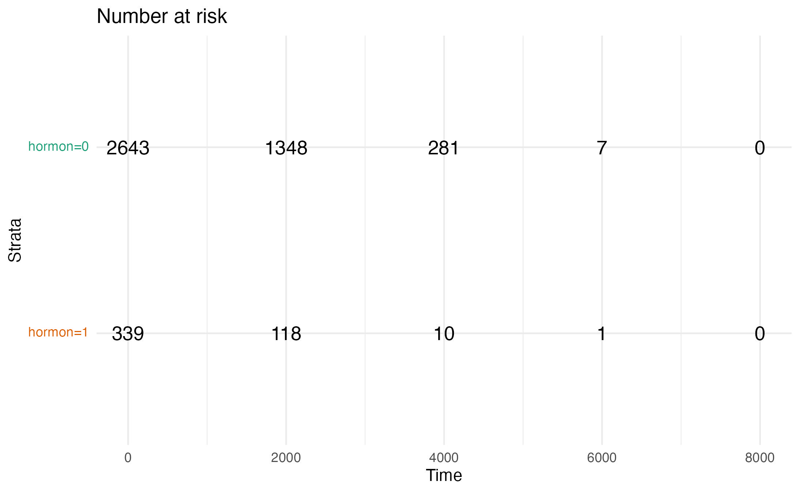

## Result

### K-M estimator Curve

In our study, we began by plotting the Kaplan-Meier (K-M) survival estimator curve for all patients, as illustrated in the provided figure. The overall median survival time for the entire cohort was found to be 2458 days.

We then proceeded to examine the K-M survival curves stratified by hormone therapy acceptance. The results, also depicted in a figure, revealed a noticeable difference based on hormone therapy status. Specifically, patients who received hormone therapy had a median survival time of 1746 days, while those who did not undergo hormone therapy exhibited a longer median survival time of 2611 days.

Further delving into the data, we stratified the survival analysis by both hormone therapy and chemotherapy acceptance. For patients who did not receive hormone therapy (hormon = 0), the median survival times varied based on chemotherapy status: 2097 days for those who underwent chemotherapy (chemo = 1) and 2774 days for those who did not (chemo = 0). Conversely, among patients who received hormone therapy, the median survival time was significantly longer at 3603 days for those who also accepted chemotherapy, but it was shorter, at 1614 days, for those who did not receive chemotherapy.

### Log-rank test

The log-rank test for whether the patients received hormone therapy indicated a statistically significant difference in survival between patients based on hormone treatment status (p-value = 0.0003).This suggests a strong association of hormone therapy with survival outcomes.

The log-rank test for chemotherapy groups yielded a non-significant p-value of 0.4.
This implies a lack of statistical evidence for the impact of chemotherapy on survival outcomes when not considering hormone therapy status.

A stratified log-rank test for Hormonal Treatment, taking into account chemotherapy status, showed a significant difference in survival between hormone treatment groups (p-value = 0.0001). This finding reinforces the role of hormone therapy in influencing survival outcomes and indicates that its effect is consistent across chemotherapy status.

### Cox Proportional Model:

#### Proportional Hazard Checking:
  The proportional hazard assumption were evaluated using Schoenfeld residuals. The plots for each covariate were examined (shown in figure ), and no clear trend over time was observed, suggesting no assumption might be violated.  We further plotted Kaplan-Meier log-log survival plots for categorical variables, which are commonly used to visually assess the proportional hazards (PH) assumption in survival analysis. We noticed that the curves in each plot are all approximately paralled, which confirmed our  that no variable violate the PH assumption.

#### Model fitting:

We fit the initial Cox proportional hazard model for all variables. The final model was selected using the stepwise AIC method with both forward and backward selection strategies. The stepwise selection process iteratively added or removed variables based on their impact on the Akaike Information Criterion (AIC).

#### Model interpretation: 

After variable selection , the final model includes age,size, number of nodes and chemotherapy as predictors. 

Coefficients and Hazard Ratios:

Age: The coefficient is 0.0042, indicating a small increase in hazard with increasing age. The hazard ratio is 1.0043, meaning each additional year of age increases the hazard by approximately 0.4%. This effect is statistically significant (p = 0.0493).

Size20-50 and size>50: These categories show significant increases in hazard compared to the reference category (presumably size <20). The hazard ratios are 1.43 and 1.91, respectively, indicating substantially higher hazards for larger tumor sizes.

Nodes: Each additional node increases the hazard by 7.75%. The hazard ratio is 1.077534, which is highly significant.

Grade: Change from grade from 2 to 3 in differentiation grade is associated with a 40% increase in hazard (hazard ratio = 1.3992, p = 2.9e-08), indicating that higher grades are associated with poorer prognosis.

Chemo: The coefficient for chemotherapy is -0.098, suggesting a protective effect (reduced hazard), but this is not statistically significant (p = 0.15).

Hormon: The coefficient for chemotherapy is -0.12, suggesting a protective effect (reduced hazard), but this is not statistically significant (p = 0.11).

Additionally, the concordance index is 0.67, indicating a moderate predictive accuracy of the model. Also, likelihood Ratio, Wald, and Score Tests have highly significant p-values (<2e-16), indicating that the model as a whole is a significant improvement over a null model with no covariates.

In summary, the model suggests that age, tumor size, number of nodes , chemotherapy and hormonal therapy are significant predictors of the hazard. Larger tumor sizes and more nodes are associated with higher hazards. Age shows a small but significant effect. Chemotherapy and hormon, while indicating a protective effect, is not statistically significant in this model.

